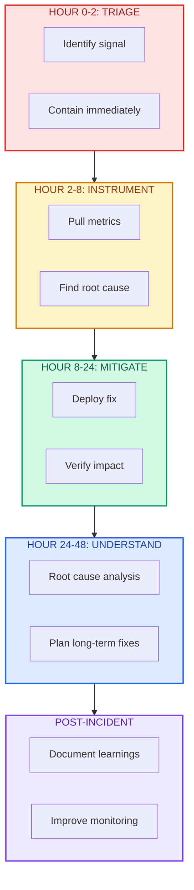

# Crisis Playbook

| | |
|:--|:--|
| **Use when** | System is failing, margin collapsing, quality dropping, or unexplained behavior at scale |
| **Time** | Fill in as you go (this is your incident log) |
| **Outcome** | Containment, root cause, fixes planned, stakeholders informed |
| **Related** | [Cost Spike Runbook](cost-spike-runbook.md) ・ [Incident Post-Mortem](incident-postmortem.md) |

---

Crisis playbook for when margin is collapsing, quality is dropping, or the system is breaking.

Use this when you do not have time for a full investigation. Act first, understand later.



---

## Hour 0-2: Triage

### Identify the Signal

| Question | Answer |
|----------|--------|
| What metric is broken? | &emsp;&emsp;&emsp;&emsp;&emsp;&emsp;&emsp;&emsp;&emsp;&emsp;&emsp;&emsp;&emsp;&emsp;&emsp;&emsp;&emsp;&emsp;&emsp;&emsp; |
| When did it start? | &emsp;&emsp;&emsp;&emsp;&emsp;&emsp;&emsp;&emsp;&emsp;&emsp;&emsp;&emsp;&emsp;&emsp;&emsp;&emsp;&emsp;&emsp;&emsp;&emsp; |
| What changed around that time? | &emsp;&emsp;&emsp;&emsp;&emsp;&emsp;&emsp;&emsp;&emsp;&emsp;&emsp;&emsp;&emsp;&emsp;&emsp;&emsp;&emsp;&emsp;&emsp;&emsp; |
| Severity (1-10) | &emsp;&emsp;&emsp;&emsp;&emsp;&emsp;&emsp;&emsp;&emsp;&emsp;&emsp;&emsp;&emsp;&emsp;&emsp;&emsp;&emsp;&emsp;&emsp;&emsp; |
| Is it getting worse? | &emsp;&emsp;&emsp;&emsp;&emsp;&emsp;&emsp;&emsp;&emsp;&emsp;&emsp;&emsp;&emsp;&emsp;&emsp;&emsp;&emsp;&emsp;&emsp;&emsp; |

### Immediate Containment

Run through this list. Stop at the first option that applies.

- [ ] Can we roll back the last deploy?
- [ ] Can we disable the affected feature?
- [ ] Can we rate-limit the affected path?
- [ ] Can we route traffic away from the problem?

| Containment Action | Time Applied | Effective? |
|-------------------|--------------|------------|
| &emsp;&emsp;&emsp;&emsp;&emsp;&emsp;&emsp;&emsp;&emsp;&emsp;&emsp;&emsp;&emsp;&emsp;&emsp;&emsp;&emsp;&emsp;&emsp;&emsp;&emsp;&emsp;&emsp;&emsp;&emsp;&emsp;&emsp;&emsp;&emsp;&emsp; | &emsp;&emsp;&emsp;&emsp;&emsp;&emsp;&emsp;&emsp; | &emsp;&emsp;&emsp;&emsp;&emsp;&emsp; |
| &emsp; | &emsp; | &emsp; |
| &emsp; | &emsp; | &emsp; |

---

## Hour 2-8: Instrument

### Get Visibility

Pull these metrics for the last 7 days:

- [ ] Cost per outcome (find the spike)
- [ ] Recompute ratio (total compute / successful outputs)
- [ ] Top 5 trigger types by cost
- [ ] Retry rates by tool/endpoint
- [ ] Latency percentiles (p50, p95, p99)

<details>
<summary><strong>Example: Cost per outcome query</strong></summary>

```sql
SELECT
  DATE_TRUNC('day', created_at) as day,
  SUM(inference_cost_usd + orchestration_cost_usd) as total_cost,
  COUNT(DISTINCT CASE WHEN state = 'committed' THEN output_id END) as successful_outputs,
  SUM(inference_cost_usd + orchestration_cost_usd) 
    / NULLIF(COUNT(DISTINCT CASE WHEN state = 'committed' THEN output_id END), 0) as cost_per_outcome
FROM decision_envelopes
WHERE created_at > NOW() - INTERVAL '7 days'
GROUP BY 1
ORDER BY 1;
```

</details>

### Find the Smoking Gun

| Metric | Before | After | Delta |
|--------|--------|-------|-------|
| Cost per outcome | &emsp;&emsp;&emsp;&emsp;&emsp;&emsp; | &emsp;&emsp;&emsp;&emsp;&emsp;&emsp; | &emsp;&emsp;&emsp;&emsp;&emsp;&emsp; |
| Recompute ratio | &emsp;&emsp;&emsp;&emsp;&emsp;&emsp; | &emsp;&emsp;&emsp;&emsp;&emsp;&emsp; | &emsp;&emsp;&emsp;&emsp;&emsp;&emsp; |
| Retry rate | &emsp;&emsp;&emsp;&emsp;&emsp;&emsp; | &emsp;&emsp;&emsp;&emsp;&emsp;&emsp; | &emsp;&emsp;&emsp;&emsp;&emsp;&emsp; |
| Latency p95 | &emsp;&emsp;&emsp;&emsp;&emsp;&emsp; | &emsp;&emsp;&emsp;&emsp;&emsp;&emsp; | &emsp;&emsp;&emsp;&emsp;&emsp;&emsp; |
| Cache hit rate | &emsp;&emsp;&emsp;&emsp;&emsp;&emsp; | &emsp;&emsp;&emsp;&emsp;&emsp;&emsp; | &emsp;&emsp;&emsp;&emsp;&emsp;&emsp; |

| Most likely root cause |
|------------------------|
| &emsp;&emsp;&emsp;&emsp;&emsp;&emsp;&emsp;&emsp;&emsp;&emsp;&emsp;&emsp;&emsp;&emsp;&emsp;&emsp;&emsp;&emsp;&emsp;&emsp;&emsp;&emsp;&emsp;&emsp;&emsp;&emsp;&emsp;&emsp;&emsp;&emsp;&emsp;&emsp;&emsp;&emsp;&emsp;&emsp;&emsp;&emsp;&emsp;&emsp;&emsp;&emsp;&emsp;&emsp;&emsp;&emsp;&emsp;&emsp;&emsp;&emsp;&emsp;&emsp;&emsp;&emsp;&emsp;&emsp;&emsp;&emsp;&emsp;&emsp; |
| &emsp; |
| &emsp; |

---

## Hour 8-24: Stop the Bleeding

### Short-Term Mitigations

Pick the fastest path to stability:

- [ ] Cache the expensive path
- [ ] Gate the expensive action (add confirmation step)
- [ ] Reduce retry limits
- [ ] Increase rate limits on affected endpoints
- [ ] Disable non-critical features
- [ ] Roll back recent changes

| Field | Value |
|-------|-------|
| Mitigation deployed | &emsp;&emsp;&emsp;&emsp;&emsp;&emsp;&emsp;&emsp;&emsp;&emsp;&emsp;&emsp;&emsp;&emsp;&emsp;&emsp;&emsp;&emsp;&emsp;&emsp;&emsp;&emsp;&emsp;&emsp;&emsp;&emsp;&emsp;&emsp; |
| Impact observed | &emsp;&emsp;&emsp;&emsp;&emsp;&emsp;&emsp;&emsp;&emsp;&emsp;&emsp;&emsp;&emsp;&emsp;&emsp;&emsp;&emsp;&emsp;&emsp;&emsp;&emsp;&emsp;&emsp;&emsp;&emsp;&emsp;&emsp;&emsp; |
| Time applied | &emsp;&emsp;&emsp;&emsp;&emsp;&emsp;&emsp;&emsp;&emsp;&emsp;&emsp;&emsp;&emsp;&emsp;&emsp;&emsp;&emsp;&emsp;&emsp;&emsp;&emsp;&emsp;&emsp;&emsp;&emsp;&emsp;&emsp;&emsp; |

---

## Hour 24-48: Understand

### Root Cause Analysis

| Question | Answer |
|----------|--------|
| What was the root cause? | &emsp;&emsp;&emsp;&emsp;&emsp;&emsp;&emsp;&emsp;&emsp;&emsp;&emsp;&emsp;&emsp;&emsp;&emsp;&emsp;&emsp;&emsp;&emsp;&emsp; |
| Why did we not catch it earlier? | &emsp;&emsp;&emsp;&emsp;&emsp;&emsp;&emsp;&emsp;&emsp;&emsp;&emsp;&emsp;&emsp;&emsp;&emsp;&emsp;&emsp;&emsp;&emsp;&emsp; |
| What would have prevented this? | &emsp;&emsp;&emsp;&emsp;&emsp;&emsp;&emsp;&emsp;&emsp;&emsp;&emsp;&emsp;&emsp;&emsp;&emsp;&emsp;&emsp;&emsp;&emsp;&emsp; |
| Is this a symptom of a deeper problem? | &emsp;&emsp;&emsp;&emsp;&emsp;&emsp;&emsp;&emsp;&emsp;&emsp;&emsp;&emsp;&emsp;&emsp;&emsp;&emsp;&emsp;&emsp;&emsp;&emsp; |

### Long-Term Fixes

| Fix | Owner | Timeline | Priority |
|-----|-------|----------|----------|
| &emsp;&emsp;&emsp;&emsp;&emsp;&emsp;&emsp;&emsp;&emsp;&emsp;&emsp;&emsp;&emsp;&emsp;&emsp;&emsp;&emsp;&emsp;&emsp;&emsp; | &emsp;&emsp;&emsp;&emsp;&emsp;&emsp; | &emsp;&emsp;&emsp;&emsp;&emsp;&emsp; | &emsp;&emsp;&emsp;&emsp;&emsp;&emsp; |
| &emsp; | &emsp; | &emsp; | &emsp; |
| &emsp; | &emsp; | &emsp; | &emsp; |
| &emsp; | &emsp; | &emsp; | &emsp; |
| &emsp; | &emsp; | &emsp; | &emsp; |

---

## Communication

### Internal

| Stakeholder | Update sent? | By whom? |
|-------------|--------------|----------|
| CEO/CTO | &emsp;&emsp;&emsp;&emsp;&emsp;&emsp;&emsp;&emsp; | &emsp;&emsp;&emsp;&emsp;&emsp;&emsp;&emsp;&emsp; |
| Engineering team | &emsp;&emsp;&emsp;&emsp;&emsp;&emsp;&emsp;&emsp; | &emsp;&emsp;&emsp;&emsp;&emsp;&emsp;&emsp;&emsp; |
| Product | &emsp;&emsp;&emsp;&emsp;&emsp;&emsp;&emsp;&emsp; | &emsp;&emsp;&emsp;&emsp;&emsp;&emsp;&emsp;&emsp; |
| Support | &emsp;&emsp;&emsp;&emsp;&emsp;&emsp;&emsp;&emsp; | &emsp;&emsp;&emsp;&emsp;&emsp;&emsp;&emsp;&emsp; |

### External (if customer-impacting)

| Stakeholder | Update sent? | By whom? |
|-------------|--------------|----------|
| Affected customers | &emsp;&emsp;&emsp;&emsp;&emsp;&emsp;&emsp;&emsp; | &emsp;&emsp;&emsp;&emsp;&emsp;&emsp;&emsp;&emsp; |
| Status page | &emsp;&emsp;&emsp;&emsp;&emsp;&emsp;&emsp;&emsp; | &emsp;&emsp;&emsp;&emsp;&emsp;&emsp;&emsp;&emsp; |
| Sales (for active deals) | &emsp;&emsp;&emsp;&emsp;&emsp;&emsp;&emsp;&emsp; | &emsp;&emsp;&emsp;&emsp;&emsp;&emsp;&emsp;&emsp; |

---

## Post-Incident

- [ ] Post-mortem scheduled
- [ ] Monitoring improved to catch this earlier
- [ ] Runbook updated
- [ ] This incident added to next system drift review

---

## The Litmus Test

> Can you explain what happened, why, and what you are doing about it in 2 minutes?

Practice the explanation. You will need it.

| Question | Your Answer |
|----------|-------------|
| What happened? | &emsp;&emsp;&emsp;&emsp;&emsp;&emsp;&emsp;&emsp;&emsp;&emsp;&emsp;&emsp;&emsp;&emsp;&emsp;&emsp;&emsp;&emsp;&emsp;&emsp;&emsp;&emsp;&emsp;&emsp;&emsp;&emsp;&emsp;&emsp; |
| Why? | &emsp;&emsp;&emsp;&emsp;&emsp;&emsp;&emsp;&emsp;&emsp;&emsp;&emsp;&emsp;&emsp;&emsp;&emsp;&emsp;&emsp;&emsp;&emsp;&emsp;&emsp;&emsp;&emsp;&emsp;&emsp;&emsp;&emsp;&emsp; |
| What are we doing about it? | &emsp;&emsp;&emsp;&emsp;&emsp;&emsp;&emsp;&emsp;&emsp;&emsp;&emsp;&emsp;&emsp;&emsp;&emsp;&emsp;&emsp;&emsp;&emsp;&emsp;&emsp;&emsp;&emsp;&emsp;&emsp;&emsp;&emsp;&emsp; |

---

## Incident Summary

| Field | Value |
|-------|-------|
| Incident lead | &emsp;&emsp;&emsp;&emsp;&emsp;&emsp;&emsp;&emsp;&emsp;&emsp;&emsp;&emsp;&emsp;&emsp;&emsp;&emsp;&emsp;&emsp;&emsp;&emsp; |
| Start time | &emsp;&emsp;&emsp;&emsp;&emsp;&emsp;&emsp;&emsp;&emsp;&emsp;&emsp;&emsp;&emsp;&emsp;&emsp;&emsp;&emsp;&emsp;&emsp;&emsp; |
| Resolution time | &emsp;&emsp;&emsp;&emsp;&emsp;&emsp;&emsp;&emsp;&emsp;&emsp;&emsp;&emsp;&emsp;&emsp;&emsp;&emsp;&emsp;&emsp;&emsp;&emsp; |
| Total duration | &emsp;&emsp;&emsp;&emsp;&emsp;&emsp;&emsp;&emsp;&emsp;&emsp;&emsp;&emsp;&emsp;&emsp;&emsp;&emsp;&emsp;&emsp;&emsp;&emsp; |
| Status | &emsp;&emsp;&emsp;&emsp;&emsp;&emsp;&emsp;&emsp;&emsp;&emsp;&emsp;&emsp;&emsp;&emsp;&emsp;&emsp;&emsp;&emsp;&emsp;&emsp; |
