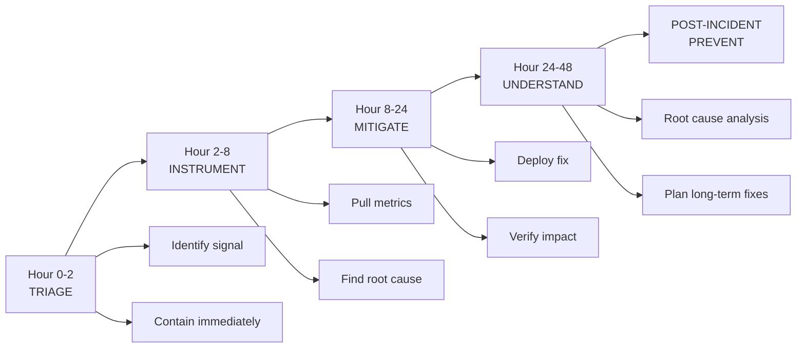

# First 48 Hours

> **Use when:** System is failing, margin collapsing, quality dropping, or unexplained behavior at scale.
>
> **Time:** Fill in as you go. This is your incident log.
>
> **After completing:** You will have containment, root cause, fixes planned, and stakeholders informed.

---

Crisis playbook for when margin is collapsing, quality is dropping, or the system is breaking.

Use this when you do not have time for a full investigation. Act first, understand later.



---

## Hour 0-2: Triage

### Identify the Signal

| Question | Answer |
|----------|--------|
| What metric is broken? | |
| When did it start? | |
| What changed around that time? | |
| Severity (1-10) | |
| Is it getting worse? | |

### Immediate Containment

Run through this list. Stop at the first option that applies.

- [ ] Can we roll back the last deploy?
- [ ] Can we disable the affected feature?
- [ ] Can we rate-limit the affected path?
- [ ] Can we route traffic away from the problem?

**Action taken:**

---

## Hour 2-8: Instrument

### Get Visibility

Pull these metrics for the last 7 days:

- [ ] Cost per outcome (find the spike)
- [ ] Recompute ratio (total compute / successful outputs)
- [ ] Top 5 trigger types by cost
- [ ] Retry rates by tool/endpoint
- [ ] Latency percentiles (p50, p95, p99)

<details>
<summary><strong>Example: Cost per outcome query</strong></summary>

```sql
SELECT
  DATE_TRUNC('day', created_at) as day,
  SUM(inference_cost_usd + orchestration_cost_usd) as total_cost,
  COUNT(DISTINCT CASE WHEN state = 'committed' THEN output_id END) as successful_outputs,
  SUM(inference_cost_usd + orchestration_cost_usd) 
    / NULLIF(COUNT(DISTINCT CASE WHEN state = 'committed' THEN output_id END), 0) as cost_per_outcome
FROM decision_envelopes
WHERE created_at > NOW() - INTERVAL '7 days'
GROUP BY 1
ORDER BY 1;
```

</details>

### Find the Smoking Gun

| Metric | Before | After | Delta |
|--------|--------|-------|-------|
| Cost per outcome | | | |
| Recompute ratio | | | |
| Retry rate | | | |
| Latency p95 | | | |
| Cache hit rate | | | |

**Most likely root cause:**

---

## Hour 8-24: Stop the Bleeding

### Short-Term Mitigations

Pick the fastest path to stability:

- [ ] Cache the expensive path
- [ ] Gate the expensive action (add confirmation step)
- [ ] Reduce retry limits
- [ ] Increase rate limits on affected endpoints
- [ ] Disable non-critical features
- [ ] Roll back recent changes

**Mitigation deployed:**

**Impact observed:**

---

## Hour 24-48: Understand

### Root Cause Analysis

| Question | Answer |
|----------|--------|
| What was the root cause? | |
| Why did we not catch it earlier? | |
| What would have prevented this? | |
| Is this a symptom of a deeper problem? | |

### Long-Term Fixes

| Fix | Owner | Timeline | Priority |
|-----|-------|----------|----------|
| | | | |
| | | | |
| | | | |

---

## Communication

### Internal

| Stakeholder | Update sent? | By whom? |
|-------------|--------------|----------|
| CEO/CTO | | |
| Engineering team | | |
| Product | | |
| Support | | |

### External (if customer-impacting)

| Stakeholder | Update sent? | By whom? |
|-------------|--------------|----------|
| Affected customers | | |
| Status page | | |
| Sales (for active deals) | | |

---

## Post-Incident

- [ ] Post-mortem scheduled
- [ ] Monitoring improved to catch this earlier
- [ ] Runbook updated
- [ ] This incident added to next system drift review

---

## The Test

Can you explain what happened, why, and what you are doing about it in 2 minutes?

Practice the explanation. You will need it.

---

**Incident lead:**
**Start time:**
**Resolution time:**
**Status:**
