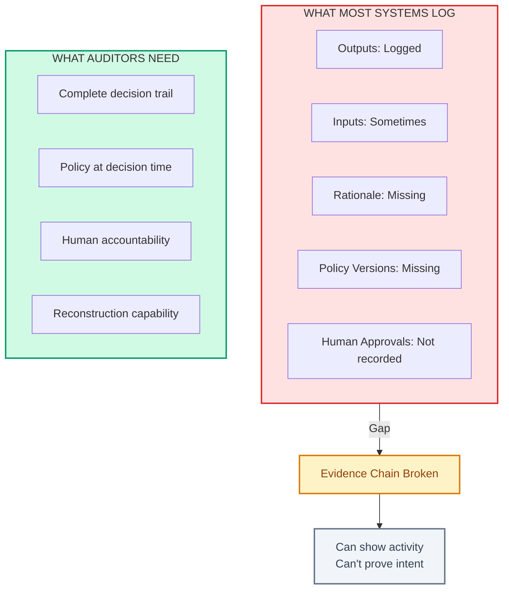

# Auditability Gap

> [!TIP]
> **Read this when:** A customer or auditor asked how you made a decision and you could not answer.

| | |
|---|---|
| **Time** | 20 min read, 4-8 hours to implement |
| **Outcome** | Evidence capture requirements, implementation schema |
| **Prerequisites** | None |
| **Related** | [Audit Preparation](../04-compliance/audit-preparation.md) ・ [State Model](../02-architecture/state-model.md) |

---

You can show outputs, but you cannot prove rationale or provenance.

Auditability is not logging. Logging tells you what happened. Auditability proves why.

---

## The Gap

Most AI systems have this problem:



| Component | Logged? | Auditable? |
|-----------|---------|------------|
| Outputs | Yes | - |
| Inputs | Sometimes | - |
| Rationale | No | No |
| Policy versions | No | No |
| Human approvals | Exists but not recorded | No |

The evidence chain is broken. You can show activity without proving intent.

---

## The Signals

Measure these quarterly:

| Signal | Healthy | Warning | Critical |
|--------|---------|---------|----------|
| Outputs with complete decision envelope | Over 95% | 80-95% | Under 80% |
| Critical outputs missing policy version | Under 5% | 5-10% | Over 10% |
| Decision reconstruction time | Under 10 min | 10 min - 1 day | Over 1 day |
| Human approvals with no audit record | None | Any | Any critical |

---

## The Consequences

| Consequence | Impact |
|-------------|--------|
| Regulatory exposure | Cannot prove compliance |
| Lost enterprise deals | Customers require audit trails you cannot provide |
| Legal risk | Unverifiable decisions become liabilities |
| Internal confusion | Teams disagree about "what the system knew" |

---

## The Cost

The question that kills deals: "Why did your system make this recommendation?"

If your answer is narrative instead of evidence, you have lost. Enterprise buyers have heard "we think it is because..." too many times. They want receipts.

Enterprise deals die in the final security review because the vendor cannot produce a decision record. Not because the decision was wrong, but because they cannot prove it was right.

---

## The Fix

### 1. Persist Provenance With Every Decision

Minimum viable decision envelope:

```json
{
  "trace_id": "uuid",
  "timestamp": "iso8601",
  "inputs": {
    "user_action": "generate",
    "context_hash": "sha256:..."
  },
  "policy": {
    "prompt_version": "v2.3",
    "model_version": "gpt-4-0125",
    "guardrails_version": "v1.2"
  },
  "tool_calls": [
    {
      "tool": "search",
      "input_hash": "sha256:...",
      "output_hash": "sha256:...",
      "timestamp": "iso8601"
    }
  ],
  "output": {
    "result_id": "uuid",
    "state": "committed",
    "content_hash": "sha256:..."
  },
  "approvals": [
    {
      "approver": "user@company.com",
      "action": "approved",
      "timestamp": "iso8601"
    }
  ]
}
```

See: [Full schema](../07-examples/decision-envelope-schema.json)

### 2. Version Everything That Affects Output

| Component | Version Strategy |
|-----------|------------------|
| Prompt templates | Semantic versioning, git-controlled |
| Model versions | Record exact model identifier |
| Guardrails and policies | Version with prompts |
| Tool configurations | Include in decision envelope |

If you change any of these, the output might change. Version them.

### 3. Retain Evidence for Your Compliance Window

| Industry | Typical Retention |
|----------|-------------------|
| Healthcare | 6-10 years |
| Finance | 5-7 years |
| Enterprise SaaS | Per customer contract |
| Consumer | Check local regulations |

Design for the longest window you might need.

### 4. Make Reconstruction Possible Without Live Systems

The test: can you explain a decision from 6 months ago using only stored data?

If reconstruction requires:
- Calling current model (models change)
- Accessing live databases (data changes)
- Asking the team (people leave)

...you have an auditability gap.

---

## Checklist

Use this to assess your auditability:

- [ ] Every output has a decision envelope
- [ ] Decision envelope includes policy versions
- [ ] Tool calls are logged with input/output hashes
- [ ] Human approvals are recorded with timestamps
- [ ] Evidence retention meets compliance requirements
- [ ] Reconstruction has been tested with historical data

---

## Investigation Process

When a customer or auditor asks "why did the system do X?":

1. Retrieve the decision envelope by output ID or trace ID
2. Confirm the policy versions in effect
3. Reconstruct the input context from stored data
4. Trace any tool calls and their outputs
5. Identify any human approvals in the chain
6. Produce a summary document with evidence links

Target: Complete this in under 10 minutes.

---

## The Litmus Test

> Can you reproduce why a decision was made last quarter without live systems?

If the answer involves "we would have to check with the team" or "we would need to look at the logs," you have an auditability gap.

---

## Related

- [Audit Preparation](../04-compliance/audit-preparation.md) - Full audit preparation process
- [Pre-Ship Checklist](../00-templates/pre-ship-checklist.md) - Auditability requirements before shipping
- [State Model](../02-architecture/state-model.md) - Designing for auditability
