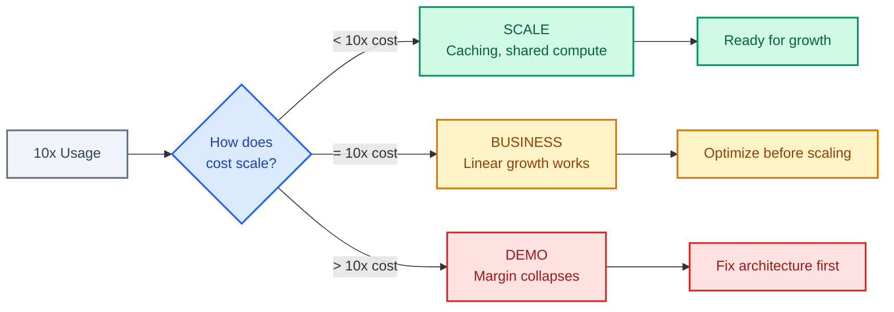

# Margin Fragility

- **Use when**: Costs are growing faster than revenue, or you need to model economics at 10x scale
- **Time**: 25 min read, then use Cost Investigation for diagnosis
- **Outcome**: Driver understanding, monitoring guidance, fix checklist
- **Related**: [Cost Investigation](../03-economics/cost-investigation.md) ・ [Hidden Recompute](../03-economics/hidden-recompute.md)

---

Unit economics degrade as usage scales, often without a clear cause.

Your product can be "successful" and still become unprofitable. Margin fragility is when growth makes you poorer.

---

## The Drivers

| Driver | Mechanism |
|--------|-----------|
| Rising recompute per user | Users develop expensive habits |
| Increased orchestration overhead | Multi-agent systems multiply calls |
| Safety and compliance layers added late | Retrofit is expensive |
| API pricing volatility | Vendor changes break your model |

---

## The Signals

Measure these weekly:

| Signal | Healthy | Warning | Critical |
|--------|---------|---------|----------|
| Cost per successful outcome | Stable or declining | Rising under 10% MoM | Rising over 10% MoM |
| Hidden recompute ratio | Under 20% | 20-35% | Over 35% |
| Cache hit rate | Over 70% | 50-70% | Under 50% |
| Infrastructure spend as % of revenue | Declining | Stable | Rising |

---

## The Cost

The uncomfortable question: "Why is our inference spend up but output volume is not?"

The answer is almost always one of two things:

1. **Hidden recompute** - compute happening without creating user value (undo loops, auto-save triggers, silent retries)
2. **Context waste** - large parts of the AI context are identical across users but being recomputed every time

The fix for context waste is often straightforward: implement shared system and tool-prompt caching. If large parts of context are identical across users, cache them. This can reduce per-conversation cost significantly without affecting response quality.

---

## The Fix

### 1. Track Cost per Successful Outcome, Not per Request

The formula:

```
cost_per_outcome = (inference_cost + orchestration_overhead + retry_cost) / successful_outputs
```

If this number rises while traffic is flat, you have hidden recompute.

<details>
<summary><strong>Example: Cost per outcome query</strong></summary>

```sql
SELECT
  DATE_TRUNC('day', created_at) as day,
  SUM(inference_cost_usd + orchestration_cost_usd) as total_cost,
  COUNT(DISTINCT CASE WHEN state = 'committed' THEN output_id END) as successful_outputs,
  SUM(inference_cost_usd + orchestration_cost_usd) 
    / NULLIF(COUNT(DISTINCT CASE WHEN state = 'committed' THEN output_id END), 0) as cost_per_outcome
FROM decision_envelopes
WHERE created_at > NOW() - INTERVAL '30 days'
GROUP BY 1
ORDER BY 1;
```

</details>

### 2. Eliminate Hidden Recompute

Sources to investigate:

| Source | Detection | Fix |
|--------|-----------|-----|
| Silent retries | High retry rate | Retry limits, exponential backoff |
| Context invalidation from user actions | Correlation with edit events | Incremental context updates |
| Partial failures that restart tool chains | Step failure logs | Checkpointing |
| Auto-saves triggering full pipeline runs | Auto-save event correlation | Debounce, smart triggers |

### 3. Treat Pricing, UX, and Infra as One Economic System

Your margin is not set by your model choice. It is set by the interaction between:

| Component | Controls |
|-----------|----------|
| UX | What users do |
| System | What that triggers |
| Infra | What that costs |

Optimize all three together.

### 4. Build a Roadmap for Inference Ownership

If margin depends on inference cost, you need a plan for ownership. API-only is a phase, not a destination.

See: [API vs Owned](../03-economics/api-vs-owned.md)

---

## The Margin Fragility Test

At 10x usage, do your unit economics improve, stay flat, or collapse?



| Answer | Interpretation |
|--------|----------------|
| Improve | You have scale (caching, shared compute) |
| Flat | You have a business |
| Collapse | You have a demo |

If you cannot model this, you are not ready for growth.

---

## Checklist

Use this to assess your margin fragility:

- [ ] Cost per successful outcome is tracked daily
- [ ] Hidden recompute ratio is tracked weekly
- [ ] 10x cost model exists and is reviewed quarterly
- [ ] Context caching is implemented where applicable
- [ ] Retry limits are configured on all inference paths
- [ ] API vs owned inference decision is documented

---

## Investigation Process

When margin is eroding:

1. Pull cost per outcome for last 30 days (find the inflection point)
2. Pull hidden recompute ratio (identify waste)
3. Query cost by trigger type (find expensive paths)
4. Watch session recordings (understand user behavior)
5. Model cost at 10x (understand scaling)
6. Prioritize fixes by cost reduction and effort

See: [Cost Investigation](../03-economics/cost-investigation.md) for the full process

---

## The Litmus Test

> Can you show stable or improved unit economics at 10x usage in a simple model?

If the answer is "we have not modeled that," you have margin fragility. You just have not felt it yet.

---

## Related

- [Cost Investigation](../03-economics/cost-investigation.md) - Full investigation process
- [Control Surface Drift](control-surface-drift.md) - When UX drives hidden costs
- [Hidden Recompute](../03-economics/hidden-recompute.md) - Deep dive on recompute sources
