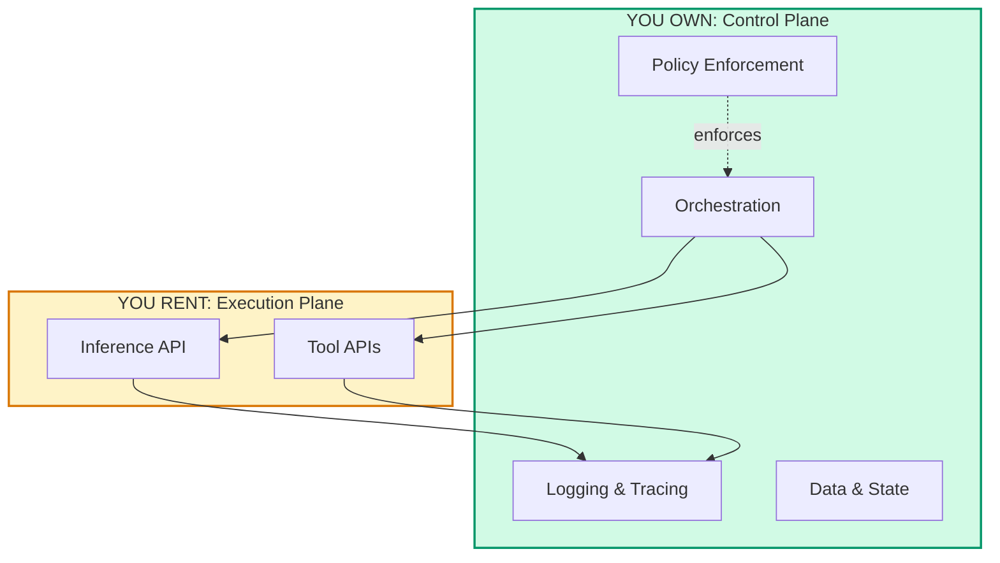

# Control Plane Ownership

> [!TIP]
> **Read this when:** Evaluating build vs buy, or assessing vendor dependency risk.

| | |
|---|---|
| **Time** | 30 min read |
| **Outcome** | Own vs rent framework, exit planning guidance |
| **Prerequisites** | None |
| **Related** | [API vs Owned](../03-economics/api-vs-owned.md) ・ [From API to Owned in 90 Days](../08-war-stories/from-api-to-owned-in-90-days.md) |

---

Who can see, change, and guarantee system behavior under pressure.

Control plane ownership determines whether you are running your system or your vendors are.

---

## Why It Hardens

Ownership decisions harden because:

| Factor | Impact |
|--------|--------|
| Vendor contracts have lock-in periods | Early termination is expensive |
| Data migrations are expensive and risky | Risk increases with data volume |
| Teams build operational muscle around specific platforms | Retraining takes time |
| Compliance certifications are tied to specific architectures | Recertification is costly |

By the time you realize you need ownership, the exit cost is high.

---

## The Problem

External dependencies become your default operating model. If you do not own the control plane, you cannot guarantee:

| Capability | Without Ownership |
|------------|-------------------|
| Auditability at infrastructure layer | Limited to vendor logs |
| Incident response timelines | Dependent on vendor SLA |
| Resilience testing | Requires vendor permission |
| Stable pricing and capacity | Subject to vendor changes |

When a vendor outage becomes your incident, you do not own the plane.

---

## The Signals

Assess these quarterly:

| Signal | Healthy | Warning | Critical |
|--------|---------|---------|----------|
| Failover requires vendor support | No critical paths | Some paths | Any critical path |
| Cannot provide infra-level audit trails | No regulated customers | Some customers | Any regulated customer |
| Vendor pricing changes shift your SLOs | Never | Once | Multiple times |
| Cannot test resilience without vendor | No critical systems | Some systems | Any critical system |

---

## Owned vs Rented

| Dimension | Rented (API) | Owned |
|-----------|--------------|-------|
| Speed to start | Fast | Slow |
| Flexibility | High | Lower |
| Cost at scale | Unpredictable | Predictable |
| Auditability | Limited | Full |
| Incident control | Vendor-dependent | Self-controlled |
| Compliance | Vendor certifications | Your certifications |
| Latency guarantees | Best effort | Deterministic |

---

## When to Own

### Stay Rented When

- You are early-stage and experimenting
- Demand is low and spiky
- Product-market fit is uncertain
- You need rapid model iteration

### Move to Owned When

- Demand is stable and predictable
- Compliance requires data locality or auditability
- You need deterministic latency guarantees
- Unit economics depend on inference cost
- A vendor outage would be a regulatory incident

---

## The Transition

The best time to plan your exit is before you are locked in.

### 1. Identify Critical Workloads Early

Which workloads require isolation, auditability, or guaranteed latency? These are candidates for ownership.

| Workload | Isolation Required | Audit Required | Latency SLO | Ownership Candidate |
|----------|-------------------|----------------|-------------|---------------------|
| &emsp;&emsp;&emsp;&emsp;&emsp;&emsp;&emsp;&emsp;&emsp;&emsp;&emsp;&emsp; | &emsp;&emsp;&emsp;&emsp;&emsp;&emsp; | &emsp;&emsp;&emsp;&emsp;&emsp;&emsp; | &emsp;&emsp;&emsp;&emsp;&emsp;&emsp; | &emsp;&emsp;&emsp;&emsp;&emsp;&emsp;&emsp;&emsp; |
| &emsp; | &emsp; | &emsp; | &emsp; | &emsp; |
| &emsp; | &emsp; | &emsp; | &emsp; | &emsp; |
| &emsp; | &emsp; | &emsp; | &emsp; | &emsp; |
| &emsp; | &emsp; | &emsp; | &emsp; | &emsp; |
| &emsp; | &emsp; | &emsp; | &emsp; | &emsp; |

### 2. Separate Control Plane From Execution Plane

Even if you rent execution (inference), you can own:

| Component | Own | Rent |
|-----------|-----|------|
| Orchestration | Consider owning | |
| Logging and tracing | Consider owning | |
| Policy enforcement | Consider owning | |
| Inference | | Consider renting initially |

### 3. Build Runbooks That Do Not Require Vendor Escalation

For every critical path, document: "What do we do if the vendor is unreachable?"

| Critical Path | Vendor | Runbook Without Vendor | Gap |
|---------------|--------|------------------------|-----|
| &emsp;&emsp;&emsp;&emsp;&emsp;&emsp;&emsp;&emsp;&emsp;&emsp;&emsp;&emsp;&emsp;&emsp; | &emsp;&emsp;&emsp;&emsp;&emsp;&emsp; | &emsp;&emsp;&emsp;&emsp;&emsp;&emsp;&emsp;&emsp;&emsp;&emsp;&emsp;&emsp;&emsp;&emsp;&emsp;&emsp;&emsp;&emsp;&emsp;&emsp; | &emsp;&emsp;&emsp;&emsp;&emsp;&emsp;&emsp;&emsp;&emsp;&emsp;&emsp;&emsp; |
| &emsp; | &emsp; | &emsp; | &emsp; |
| &emsp; | &emsp; | &emsp; | &emsp; |
| &emsp; | &emsp; | &emsp; | &emsp; |
| &emsp; | &emsp; | &emsp; | &emsp; |
| &emsp; | &emsp; | &emsp; | &emsp; |

### 4. Model Cost at 10x Before Committing

If rented pricing breaks your unit economics at scale, ownership is not optional. It is inevitable. Plan for it.

---

## Decision Framework

Use this to decide owned vs rented for each component:

| Question | If Yes | If No |
|----------|--------|-------|
| Is this a regulatory requirement? | Own | Rent possible |
| Does a vendor outage become our incident? | Own | Rent possible |
| Do we need deterministic latency? | Own | Rent possible |
| Does unit economics require ownership at scale? | Own | Rent possible |
| Are we still finding product-market fit? | Rent | Consider owning |
| Is demand low and spiky? | Rent | Consider owning |

---

## Checklist

Use this to assess your control plane ownership:

- [ ] Critical workloads requiring ownership are identified
- [ ] Control plane vs execution plane separation is documented
- [ ] Vendor-independent runbooks exist for critical paths
- [ ] Cost model at 10x usage exists
- [ ] Exit plan from current vendors is documented
- [ ] Compliance requirements for ownership are clear

---

## The Litmus Test

> If a vendor outage becomes a regulatory incident for you, do you own the control plane?

If your answer is "we would have to escalate to the vendor," you do not own it.

---

## Related

- [API vs Owned](../03-economics/api-vs-owned.md) - Cost analysis for the decision
- [Decision Record](../00-templates/decision-record.md) - Template for documenting the decision
- [Operational Independence](../04-compliance/operational-independence.md) - Compliance perspective
