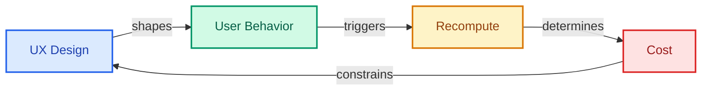
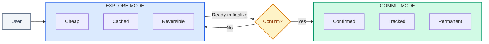

# Interaction Contract

| | |
|:--|:--|
| **Use when** | Designing what user actions trigger compute, or debugging why costs are tied to UX |
| **Time** | 25 min read, 2-4 hours to document |
| **Outcome** | UX-cost relationship understanding, cost-aware interaction framework |
| **Related** | [Cost Investigation](../03-economics/cost-investigation.md) ・ [System Drift Review](../06-operations/system-drift-review.md) |

---

What users can ask for, how often they retry, and when the system recomputes.

The interaction contract is the bridge between UX and system economics. It determines what user behavior is allowed to mutate state and what that costs.

---

## Why It Hardens

Interaction contracts harden because:

| Factor | Impact |
|--------|--------|
| Users form habits around your UX patterns | Changing flows feels like regression |
| Changing flows breaks existing workflows | Support burden increases |
| Training users is expensive and slow | Adoption of new patterns is gradual |
| Power users build automation on top of your patterns | API contracts become dependencies |

Once users depend on a behavior, removing it feels like a regression.

---

## The Problem

**UX shapes behavior. Behavior shapes recompute. Recompute shapes cost.**



If your interaction contract allows users to trigger expensive compute without knowing it, they will. Not because they are malicious, but because you made it easy.

Examples of broken contracts:

| Pattern | Problem |
|---------|---------|
| Regenerate button with no cost indicator | Users click freely |
| Undo that triggers full recompute | Expensive action feels free |
| Auto-save that runs entire pipeline | Hidden cost multiplier |
| Edit flows that invalidate large context | Small action, large cost |

---

## The Signals

Measure these monthly:

| Signal | Healthy | Warning | Critical |
|--------|---------|---------|----------|
| Regenerate/undo rate | Stable | Rising 10%+ MoM | Rising 20%+ MoM |
| Retry rate per successful outcome | Under 1.2x | 1.2-1.5x | Over 1.5x |
| Recompute from default actions | Under 15% | 15-25% | Over 25% |
| State mutations without explicit intent | Under 5% | 5-10% | Over 10% |

---

## What a Good Contract Defines

| Component | Definition |
|-----------|------------|
| When recompute happens | Explicit triggers only |
| What state can be mutated | And by which actions |
| What outputs are provisional vs final | Draft vs committed |
| What actions require confirmation | Cost gates |
| What behaviors are disallowed | Rate limits, quotas |

---

## The Principles

### 1. Distinguish Explore vs Commit Actions

Exploration should be cheap. Commitment should be explicit.



| Mode | Characteristics |
|------|-----------------|
| Explore | Cheap, cached, low-cost, reversible |
| Commit | Expensive, confirmed, tracked, potentially irreversible |

### 2. Expose Irreversible Actions Before They Happen

If an action cannot be undone, say so. If it costs money, show the cost.

### 3. Separate Draft and Final State

User edits should not immediately become permanent state. Build in a commit step.

### 4. Make Retries Intentional

If a user clicks "regenerate," they should know:
- This will cost compute
- This will replace the current output
- The previous version will still be accessible

### 5. Default to Reversible Paths

The safest action should be the default. Destructive actions should require intent.

---

## Example Contract

Document these for your product:

| Action | What It Does | Cost | Reversible | Confirmation Required |
|--------|--------------|------|------------|-----------------------|
| Edit draft | Updates local state only | Free | Yes | No |
| Preview | Runs inference, cached | Low | Yes | No |
| Regenerate | Runs inference, replaces | Medium | Yes (prior saved) | Consider adding |
| Commit | Writes to permanent state | Low | No | Yes |
| Undo | Restores prior version | Free | Yes | No |
| Delete | Removes permanently | Free | No | Yes |

---

## Implementation Patterns

### Cost Indicator Before Expensive Actions

```
[Generate Response]
This will use approximately 500 tokens (~$0.02)
[Cancel] [Continue]
```

### Explicit Mode Separation

```
Mode: [Draft] [Preview] [Final]

Draft: Edit freely, no compute cost
Preview: See AI suggestions, cached compute
Final: Commit to permanent state
```

### Undo Without Recompute

Store cached state at each generation. Undo restores cache rather than recomputing.

---

## Checklist

Use this to audit your current contract:

- [ ] All state-mutating actions are documented
- [ ] All recompute triggers are documented
- [ ] Expensive actions have cost indicators
- [ ] Irreversible actions require confirmation
- [ ] Draft and final state are explicitly separated
- [ ] Retry/regenerate behavior is intentional, not accidental
- [ ] Rate limits exist on expensive paths

---

## The Litmus Test

> List the top 5 most expensive actions in your system. Are they user-visible and explicitly confirmed?

If any expensive action is invisible or automatic, your contract is missing a gate.

---

## Related

- [Control Surface Drift](../01-failure-modes/control-surface-drift.md) - Failure mode from poor contracts
- [Cost Investigation](../03-economics/cost-investigation.md) - Finding expensive user paths
- [System Drift Review](../06-operations/system-drift-review.md) - Auditing contract drift
