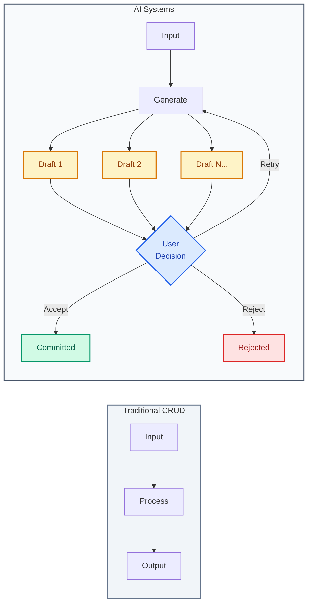
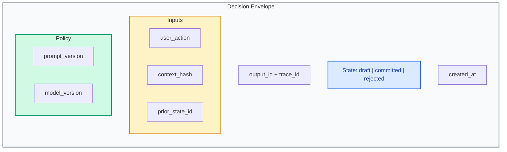

# State Model

- **Use when**: Designing a new system, or inheriting one and assessing what is locked in
- **Time**: 30 min read, 2-4 hours to apply
- **Outcome**: Persistence strategy, versioning approach, avoid rebuilding twice
- **Related**: [Decision Envelope Schema](../07-examples/decision-envelope-schema.json) ・ [Legibility Loss](../01-failure-modes/legibility-loss.md)

---

What you persist, how you version it, and whether you can explain why a result exists.

The state model is the first decision that closes your reversibility window. Get it wrong, and you will rebuild it twice.

---

## Why It Hardens

State models harden because:

| Factor | Impact |
|--------|--------|
| Downstream systems depend on your schema | Schema changes become migrations |
| User-facing APIs expose your data structures | Breaking changes affect integrations |
| Analytics and reporting build on your assumptions | Reporting breaks on schema changes |
| Migrations at scale are expensive and risky | Risk increases with data volume |

Once two teams depend on your state model, changes become migrations, not refactors.

---

## The AI-Specific Problem

AI creates **speculative state**: drafts, retries, partials, intermediate outputs.



Traditional CRUD applications have a simple state model: data goes in, data comes out. AI applications have a more complex reality:

| State Type | Traditional | AI |
|------------|-------------|-----|
| Single result per request | Yes | No (multiple generations) |
| Deterministic output | Yes | No (same input, different output) |
| Final state is obvious | Yes | No (drafts may or may not be committed) |
| History is optional | Often | Required for traceability |

If you persist only final outputs, you erase the rationale needed for traceability and audits.

---

## The Signals

Measure these weekly:

| Signal | Healthy | Warning | Critical |
|--------|---------|---------|----------|
| Outputs with complete decision record | Over 95% | 80-95% | Under 80% |
| Outputs overwritten without prior context | Under 5% | 5-15% | Over 15% |
| Outputs requiring live systems to reproduce | Under 5% | 5-20% | Over 20% |

---

## The Principles

### 1. Treat Every AI Output as Speculative State With Lineage

Do not persist outputs as facts. Persist them as decisions with context.

```json
{
  "output_id": "uuid",
  "state": "draft | committed | rejected",
  "lineage": {
    "prior_state_id": "uuid | null",
    "triggered_by": "user_action | system | retry"
  }
}
```

### 2. Persist Deltas and Decision Context, Not Just End Results

When state changes, store:

| Component | Why |
|-----------|-----|
| What changed | Enable diffing and rollback |
| Why it changed | Enable audits and debugging |
| What the prior state was | Enable reconstruction |
| Who or what triggered the change | Enable accountability |

### 3. Separate Draft From Committed State Explicitly

Never let a draft become indistinguishable from a committed output.

```json
{
  "state": "draft | committed | rejected"
}
```

Use explicit state flags. Query for committed outputs separately from drafts.

### 4. Keep an Explicit Trace From Input to Output

Every output should be traceable back to:

| Component | Record |
|-----------|--------|
| User action that triggered it | User action field |
| Context that informed it | Context hash or snapshot ID |
| Policy/model version that produced it | Prompt version, model version |

---

## The Decision Envelope

Minimum viable state for any AI output:



```json
{
  "output_id": "uuid",
  "trace_id": "uuid",
  "state": "draft | committed | rejected",
  "created_at": "iso8601",
  "inputs": {
    "user_action": "string",
    "context_hash": "string",
    "prior_state_id": "uuid | null"
  },
  "policy": {
    "prompt_version": "string",
    "model_version": "string"
  }
}
```

See: [Full schema](../07-examples/decision-envelope-schema.json)

---

## Common Mistakes

| Mistake | Consequence | Fix |
|---------|-------------|-----|
| Storing only final output | Cannot explain intermediate decisions | Store all generations with state flag |
| Overwriting on edit | Cannot reconstruct prior state | Store as new version with reference |
| No context hash | Cannot prove what system knew | Hash and store context at decision time |
| No policy versioning | Cannot reproduce decisions | Version and record all policies |

---

## Checklist

Use this before committing to a state model:

- [ ] Speculative state is explicitly flagged (draft/committed/rejected)
- [ ] Prior state is referenced on mutations
- [ ] Context is hashed or snapshotted at decision time
- [ ] Policy versions are recorded with each output
- [ ] Schema supports reconstruction without live systems
- [ ] Migration strategy exists for schema changes

---

## The Litmus Test

> If a user asks "why did this happen?" can you answer with evidence rather than narrative?

If the answer requires guesswork, your state model is missing provenance.

---

## Related

- [Decision Envelope Schema](../07-examples/decision-envelope-schema.json) - Full schema specification
- [Pre-Ship Checklist](../00-templates/pre-ship-checklist.md) - Traceability requirements
- [Legibility Loss](../01-failure-modes/legibility-loss.md) - Failure mode from poor state design
