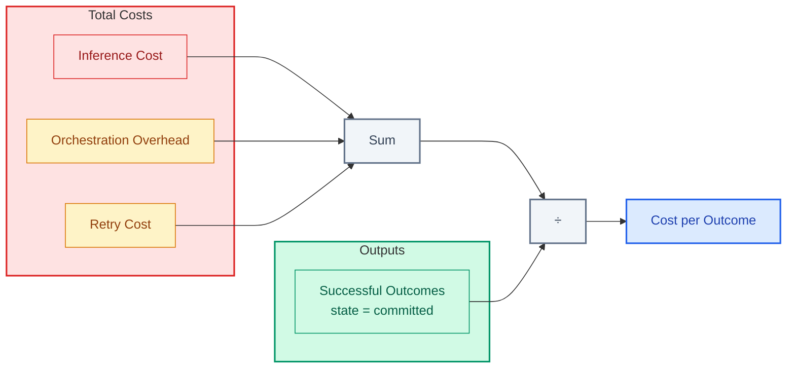

# Cost Model

| | |
|:--|:--|
| **Use when** | You need to track cost per outcome, or CFO is asking about unit economics |
| **Time** | 20 min read |
| **Outcome** | Cost calculation formulas and ready-to-run queries |
| **Related** | [Metrics Reference](../07-examples/metrics-reference.md) ・ [Margin Fragility](../01-failure-modes/margin-fragility.md) |

---

**Actual formulas for tracking cost per outcome.**

If you don't track cost per successful outcome, you're flying blind. This doc gives you the formulas and queries to instrument your system.

---

## The Core Formula



```
cost_per_outcome = (inference_cost + orchestration_overhead + retry_cost) / successful_outputs
```

This is the number that matters. Not cost per request. Not cost per API call. Cost per successful outcome.

---

## The Components

**Inference cost**
Direct cost of model calls:
- Input tokens × input price
- Output tokens × output price
- Plus any per-request fees

**Orchestration overhead**
Cost of coordination:
- Agent-to-agent communication
- State management
- Logging and tracing
- Queue processing

**Retry cost**
Cost of failed attempts:
- Failed inference calls
- Timed-out tool calls
- Partial completions that were discarded

**Successful outputs**
Outputs that reached committed state and delivered value. Not drafts. Not rejected. Committed.

---

## Queries

### Cost per successful outcome (daily)

```sql
SELECT
  DATE_TRUNC('day', created_at) as day,
  SUM(inference_cost_usd) as total_inference,
  SUM(orchestration_cost_usd) as total_orchestration,
  SUM(CASE WHEN is_retry THEN cost_usd ELSE 0 END) as total_retry,
  COUNT(DISTINCT CASE WHEN state = 'committed' THEN output_id END) as successful_outputs,
  (SUM(inference_cost_usd) + SUM(orchestration_cost_usd) + SUM(CASE WHEN is_retry THEN cost_usd ELSE 0 END))
    / NULLIF(COUNT(DISTINCT CASE WHEN state = 'committed' THEN output_id END), 0) as cost_per_outcome
FROM decision_envelopes
WHERE created_at > NOW() - INTERVAL '30 days'
GROUP BY 1
ORDER BY 1;
```

### Hidden recompute ratio

```sql
SELECT
  SUM(CASE WHEN trigger_type = 'user_explicit' THEN 1 ELSE 0 END) as explicit_computes,
  SUM(CASE WHEN trigger_type IN ('undo', 'auto_save', 'retry', 'background') THEN 1 ELSE 0 END) as hidden_computes,
  SUM(CASE WHEN trigger_type IN ('undo', 'auto_save', 'retry', 'background') THEN 1 ELSE 0 END)::float
    / NULLIF(COUNT(*), 0) as hidden_ratio
FROM inference_events
WHERE created_at > NOW() - INTERVAL '7 days';
```

### Cost by trigger type

```sql
SELECT
  trigger_type,
  COUNT(*) as event_count,
  SUM(cost_usd) as total_cost,
  AVG(cost_usd) as avg_cost,
  SUM(cost_usd) / SUM(SUM(cost_usd)) OVER () as pct_of_total
FROM inference_events
WHERE created_at > NOW() - INTERVAL '7 days'
GROUP BY 1
ORDER BY total_cost DESC;
```

### Cost per user action

```sql
SELECT
  user_action_type,
  COUNT(DISTINCT output_id) as outputs,
  SUM(cost_usd) as total_cost,
  SUM(cost_usd) / COUNT(DISTINCT output_id) as cost_per_action
FROM decision_envelopes
WHERE created_at > NOW() - INTERVAL '7 days'
GROUP BY 1
ORDER BY cost_per_action DESC;
```

---

## Dashboard Minimum

Build a dashboard with:

1. **Cost per outcome trend** (daily, 30-day view)
2. **Hidden recompute ratio** (weekly)
3. **Cost breakdown by trigger type** (pie chart)
4. **Top 5 most expensive user actions** (table)
5. **Retry rate by tool** (table)

If any of these spike, investigate immediately.

---

## The 10x Test

Model your cost at 10x usage:

```
current_cost_per_outcome = $X
projected_outcomes_at_10x = current_outcomes × 10
projected_cost_at_10x = ?
```

If cost scales linearly: `10 × current_cost` See: You're okay
If cost scales superlinearly: `>10 × current_cost` See: You have fragility
If cost scales sublinearly: `<10 × current_cost` See: You have scale

---

## The Litmus Test

> Do you know your cost per successful outcome? Is it stable, improving, or degrading?

If you don't know the number, you can't manage it.

---

> *"Track cost per outcome, not cost per request. That's the number that pays your bills."*
