# Hidden Recompute

- **Use when**: Costs are rising but traffic is flat, or you suspect UX is driving invisible compute
- **Time**: 15 min read
- **Outcome**: Hidden recompute source identification, fix patterns
- **Related**: [Metrics Reference](../07-examples/metrics-reference.md#hidden-recompute-ratio) ・ [Control Surface Drift](../01-failure-modes/control-surface-drift.md)

---

**Work the system repeats without user awareness.**

Hidden recompute is the primary cause of margin erosion in AI systems. It's compute that happens but doesn't create value.

---

## Sources

```mermaid
flowchart TB
    subgraph Hidden["HIDDEN RECOMPUTE SOURCES"]
        direction TB
        
        subgraph SR["Silent Retries"]
            SR1["API call fails"] --> SR2["Auto-retry x3"]
        end
        
        subgraph CI["Context Invalidation"]
            CI1["Small edit"] --> CI2["Full re-embedding"]
        end
        
        subgraph PF["Partial Failures"]
            PF1["Tool 3/5 fails"] --> PF2["Restart from scratch"]
        end
        
        subgraph AS["Auto-Saves"]
            AS1["Background save"] --> AS2["Full pipeline run"]
        end
        
        subgraph UF["Undo Flows"]
            UF1["User hits undo"] --> UF2["Recompute everything"]
        end
    end
    
    SR & CI & PF & AS & UF --> Cost["Hidden Cost"]
    
    style Hidden fill:#fef3c7,stroke:#d97706,stroke-width:2px
    style SR fill:#fee2e2,stroke:#dc2626,stroke-width:1px
    style CI fill:#fee2e2,stroke:#dc2626,stroke-width:1px
    style PF fill:#fee2e2,stroke:#dc2626,stroke-width:1px
    style AS fill:#fee2e2,stroke:#dc2626,stroke-width:1px
    style UF fill:#fee2e2,stroke:#dc2626,stroke-width:1px
    style Cost fill:#fee2e2,stroke:#dc2626,stroke-width:2px,color:#991b1b
    
    click Cost "../01-failure-modes/margin-fragility.md" "See Margin Fragility"
    click UF "../01-failure-modes/control-surface-drift.md" "See Control Surface Drift"
```



| Source | What Happens |
|--------|-------------|
| Silent retries | Failed calls retry automatically, invisibly |
| Context invalidation | User actions force full re-embedding |
| Partial failures | Tool chain restarts from scratch |
| Auto-saves | Background saves trigger full pipeline |
| Undo flows | Restoring state recomputes instead of caching |

---

## Detection

**1. Compare total compute to successful outcomes**

```sql
SELECT
  COUNT(*) as total_inference_calls,
  COUNT(DISTINCT CASE WHEN state = 'committed' THEN output_id END) as successful_outputs,
  COUNT(*)::float / NULLIF(COUNT(DISTINCT CASE WHEN state = 'committed' THEN output_id END), 0) as ratio
FROM inference_events
WHERE created_at > NOW() - INTERVAL '7 days';
```

If ratio > 1.3, you have hidden recompute.

**2. Track recompute per feature, not per request**

Break down by trigger type:
```sql
SELECT
  trigger_type,
  COUNT(*) as count,
  SUM(cost_usd) as total_cost
FROM inference_events
WHERE created_at > NOW() - INTERVAL '7 days'
GROUP BY 1
ORDER BY total_cost DESC;
```

**3. Inspect retry cascades**

Look for tool calls with retry_count > 0:
```sql
SELECT
  tool_name,
  AVG(retry_count) as avg_retries,
  SUM(retry_count * cost_per_call) as retry_cost
FROM tool_calls
GROUP BY 1
HAVING AVG(retry_count) > 0.5
ORDER BY retry_cost DESC;
```

**4. Identify tool calls with >1x repeats per output**

If you're calling the same tool multiple times for one output, that's recompute.

---

## Mitigation

**Cache stable context**

If context hasn't changed, don't re-embed:
```python
if context_hash == cached_hash:
    return cached_embedding
```

**Gate expensive retries**

Don't retry automatically. Make it explicit:
```python
if retry_count >= max_retries:
    return fallback_or_escalate()
```

**Simplify state transitions**

The more complex your state machine, the more opportunities for recompute. Fewer states = fewer triggers.

**Split preview vs commit compute**

Preview can use cached, lower-fidelity results. Commit runs the full pipeline. Users get fast feedback without burning margin.

---

## The Math

Hidden recompute cost = `total_inference_cost - (successful_outputs × cost_per_successful_output)`

If this number is growing faster than your revenue, you're losing.

---

## The Litmus Test

> Can you explain why total compute is higher than successful outcomes?

If you can't, hidden recompute is already eroding margin.

---

> *"The most expensive compute is the compute that creates no value."*
