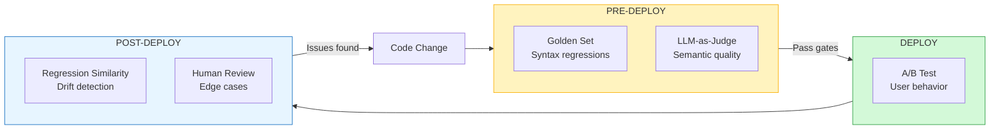

# Eval and Regression

> [!TIP]
> **Read this when:** Setting up quality gates, or after shipping a regression you did not catch.

| | |
|---|---|
| **Time** | 30 min read |
| **Outcome** | Eval landscape understanding, implementation patterns, anti-pattern awareness |
| **Prerequisites** | None (have test cases ready) |
| **Related** | [eval-gate.yml](../07-examples/eval-gate.yml) ・ [LLM-as-Judge Prompts](../07-examples/llm-as-judge-prompts.md) |

---

**The discipline that prevents silent quality drift.**

AI systems require continuous evaluation, not occasional tests. Without it, you ship regressions you can't detect.

---

## The Failure Mode

Teams rely on anecdotal feedback:
- "It feels better"
- "Users aren't complaining"
- "The demo looked good"

Then a regression ships. Quality drops. But there's no signal because there's no baseline.

---

## The Eval Landscape (2025-2026)



| Eval Type | What It Catches | When To Run |
|-----------|-----------------|-------------|
| **Offline (Golden Set)** | Regressions against known-good outputs | Pre-deploy, every PR |
| **Online (A/B)** | User behavior impact of changes | Post-deploy, gated rollout |
| **LLM-as-Judge** | Semantic quality (coherence, helpfulness, safety) | Pre-deploy + sampling in prod |
| **Human Review** | Nuanced quality, edge cases, adversarial inputs | Periodic, high-stakes outputs |
| **Regression Similarity** | Semantic drift from baseline (embedding distance) | Continuous monitoring |

**The reality**: You need all of these. Golden sets catch syntax-level regressions. LLM-as-judge catches semantic drift. Human review catches what the models miss.

---

## Modern Eval Stack

**1. Golden set (still essential)**

A fixed set of prompts and scenarios with known-good outputs:
- Cover critical paths
- Include edge cases
- Update when product changes
- Version alongside code

**2. LLM-as-Judge for semantic quality**

Use a capable model to evaluate outputs:
```python
def llm_judge(output, criteria):
    prompt = f"""
    Evaluate this output on a 1-5 scale for:
    - Helpfulness: Does it answer the question?
    - Accuracy: Is the information correct?
    - Safety: Does it avoid harmful content?

    Output: {output}

    Return JSON: {{"helpfulness": X, "accuracy": X, "safety": X, "reasoning": "..."}}
    """
    return call_judge_model(prompt)
```

**Warning**: LLM-as-judge has biases (verbosity preference, position bias). Calibrate against human labels.

**3. Regression detection via embeddings**

Track semantic drift without manual labeling:
```python
def detect_drift(new_outputs, baseline_embeddings, threshold=0.15):
    new_embeddings = embed(new_outputs)
    distances = cosine_distance(new_embeddings, baseline_embeddings)

    drifted = [i for i, d in enumerate(distances) if d > threshold]
    return drifted
```

**4. Online A/B with guardrails**

Deploy changes to a subset of users, measure real outcomes:
- Satisfaction signals (explicit ratings, implicit: time on task, retry rate)
- Downstream success metrics
- Cost per successful outcome

**5. Versioned baselines (critical)**

Every eval result is tied to:
- Model version
- Prompt version
- Policy version
- Eval framework version

So you can answer: "Did the new prompt make it better or worse?"

---

## Eval Anti-Patterns

| Anti-Pattern | Why It Fails | Fix |
|-------------|-------------|-----|
| Testing in production only | Regressions reach users before you know | Pre-deploy golden set + LLM judge |
| Anecdotal quality assessment | Can't compare over time | Versioned baselines with scores |
| Golden set that never updates | Tests become stale, miss new features | Quarterly review + new case addition |
| Evals without version tracking | Can't attribute changes | Triple-version: model + prompt + policy |
| LLM-as-judge without calibration | Systematic biases compound | Human-label calibration set |
| Ignoring output distribution | Averages hide tail failures | P95/P99 quality percentiles |

---

## Eval Pipeline Implementation

```python
class EvalPipeline:
    def __init__(self, golden_set, judge_model, baseline_embeddings):
        self.golden_set = golden_set
        self.judge = judge_model
        self.baseline = baseline_embeddings

    def run_full_eval(self, model_version, prompt_version):
        results = {
            "version": {
                "model": model_version,
                "prompt": prompt_version,
                "eval": "v2.1"
            },
            "golden_set": self.run_golden_set(model_version, prompt_version),
            "llm_judge": self.run_llm_judge(model_version, prompt_version),
            "drift": self.run_drift_detection(model_version, prompt_version)
        }

        # Aggregate decision
        results["deploy_ready"] = self.evaluate_gates(results)
        return results

    def evaluate_gates(self, results):
        """Deploy gates - all must pass"""
        gates = [
            results["golden_set"]["pass_rate"] >= 0.95,
            results["llm_judge"]["avg_score"] >= 4.0,
            results["drift"]["p95_distance"] <= 0.2,
            results["golden_set"]["critical_failures"] == 0
        ]
        return all(gates)
```

---

## Metrics That Matter

Track these over time, not just per-release:

| Metric | What It Tells You |
|--------|-------------------|
| **Eval pass rate** | % of golden set cases passing |
| **Mean quality score** | Average LLM-judge or human score |
| **P95 quality** | Tail quality - catches rare failures |
| **Drift distance** | Semantic distance from baseline outputs |
| **Eval stability** | Do evals give consistent results across runs? |

**Warning**: If your eval stability is low (same input, different scores), your eval framework is broken.

---

## Tooling Landscape

| Tool | Strength | Use Case |
|------|----------|----------|
| **Braintrust** | Structured eval workflows, versioning | Teams standardizing on eval process |
| **Langsmith** | Integrated with LangChain, good UX | LangChain-based stacks |
| **Arize Phoenix** | Open source, embedding-based drift | Cost-conscious, embedding-focused |
| **Promptfoo** | CLI-first, CI/CD integration | Developer-focused, automation |
| **Custom** | Full control, domain-specific | High-stakes, regulated domains |

---

## The Litmus Test

> If your system changes behavior, do you have a measurable signal?

If the answer is "we'd notice in user feedback," your eval discipline is insufficient.

---

## Further Reading

- [Anthropic's Model Card Evals](https://www.anthropic.com/research) - how Anthropic evaluates safety
- [HELM Benchmark](https://crfm.stanford.edu/helm/latest/) - Stanford's holistic LLM evaluation
- [Arize AI's ML Observability Guide](https://arize.com/ml-observability/) - production monitoring patterns
- [OpenAI Evals](https://github.com/openai/evals) - OpenAI's eval framework (open source)

---

> *"AI systems require continuous evaluation, not occasional tests."*
