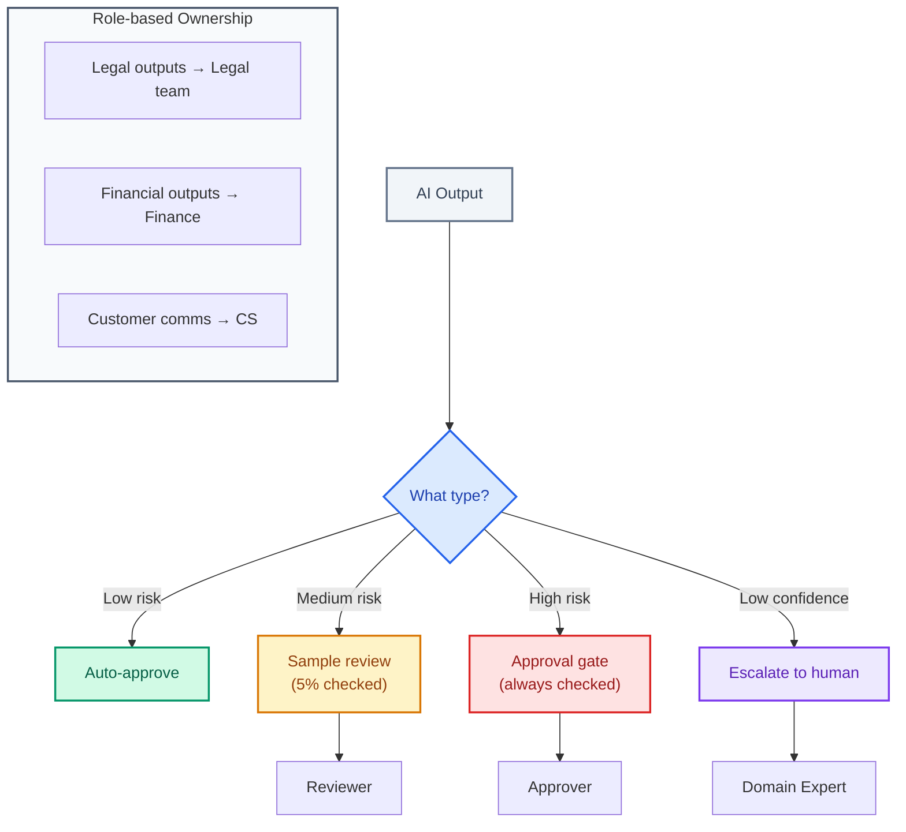

# Human in the Loop

| | |
|:--|:--|
| **Use when** | Designing approval workflows, or after accountability was unclear in an incident |
| **Time** | 15 min read |
| **Outcome** | Clear HITL ownership model with named responsibilities |
| **Related** | [Safety Surface](safety-surface.md) ・ [Audit Preparation](../04-compliance/audit-preparation.md) |

---

**Clear responsibility for when humans review, approve, or override AI output.**

HITL is not a checkbox. It's an ownership model.

---

## The Key Questions

Every AI system should have clear answers to:

| Question | Must Have Answer |
|----------|-----------------|
| Who approves final outputs? | Named role or individual |
| What decisions require human confirmation? | Explicit list |
| Who is accountable when the system is wrong? | Named role or individual |
| What happens when the system is uncertain? | Defined escalation path |

---

## The Failure Mode

Teams assume "someone" will review outputs, but ownership is undefined.

What happens:
- Critical outputs go unreviewed
- Multiple people assume someone else checked
- Incidents reveal no one was accountable
- Post-mortems become blame games

---

## Ownership Patterns



**1. Role-based ownership**

Define which roles are accountable for which output types:
- Legal review See: Legal team
- Financial outputs See: Finance approval
- Customer communications See: Customer success

**2. Threshold-based escalation**

Low-confidence outputs require human review:
```python
if output.confidence < threshold:
    escalate_to_human(output)
```

**3. Sampling-based review**

Randomly sample outputs for human review to catch drift:
- 5% of all outputs reviewed
- 100% of first-time scenarios reviewed
- Higher sampling for new model versions

**4. Approval gates for high-impact actions**

Some actions always require human approval:
- Customer-facing content
- Financial transactions
- Data deletions
- External API calls

---

## Accountability Model

For every output type, document:

| Output Type | Reviewer | Approver | Accountable Owner |
|-------------|----------|----------|-------------------|
| Generated report | Auto | User | Product Manager |
| Customer email | User | User | Support Lead |
| Financial projection | Analyst | CFO | CFO |

---

## The Litmus Test

> If a critical output is wrong, can you name the accountable owner in under 10 seconds?

If the answer is "it depends" or "we'd have to check," accountability is undefined.

---

> *"HITL is not a checkbox. It's an ownership model."*
