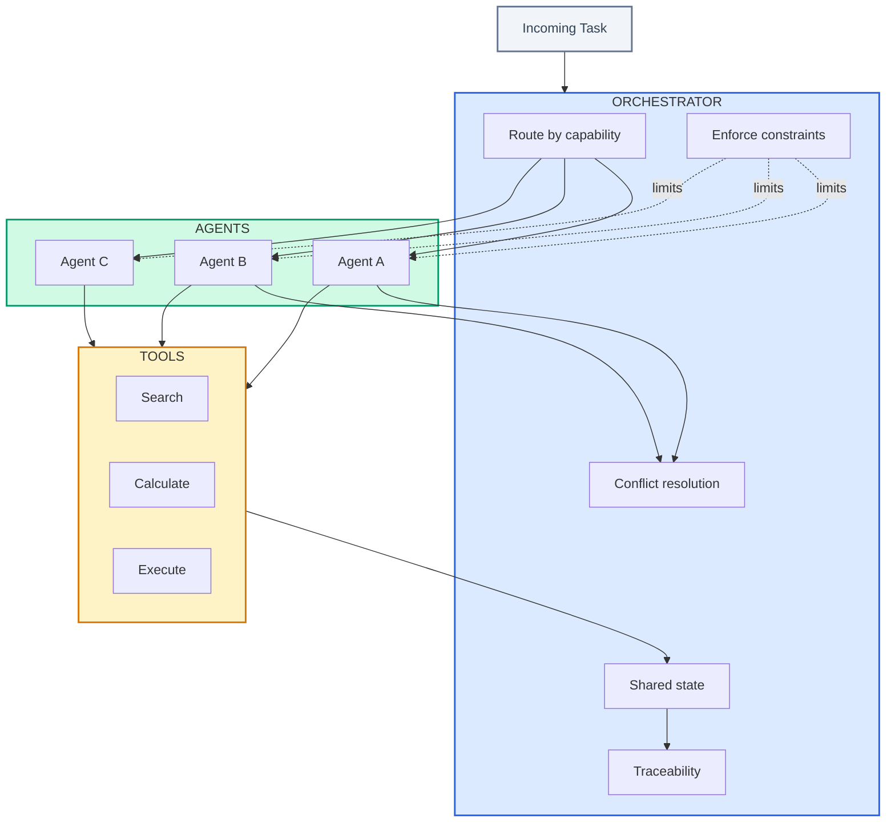
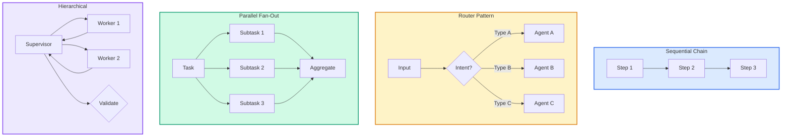

# Orchestration

| | |
|:--|:--|
| **Use when** | Designing multi-agent coordination, or debugging why agents are not working together |
| **Time** | 30 min read |
| **Outcome** | Orchestration patterns, failure mode awareness, reference implementation |
| **Related** | [orchestrator.py](../07-examples/orchestrator.py) ・ [Tool Reliability](tool-reliability.md) |

---

**The control plane that sequences agents, tools, and state transitions.**

In multi-agent systems, orchestration is the product. Without it, behavior becomes emergent and ungovernable.

---

## What Orchestration Does



- Routes tasks to agents based on capability and context
- Enforces global constraints (cost, latency, safety)
- Maintains a shared state model across agents
- Provides traceability across the chain
- Resolves conflicts when agents disagree

---

## Orchestration Patterns (2025-2026)



| Pattern | When To Use | Trade-offs |
|---------|-------------|-----------|
| **Sequential Chain** | Simple pipelines, each step depends on previous | Easy to debug, but slow; no parallelism |
| **Router (Intent Classification)** | Multiple specialized agents for different intents | Fast dispatch, but routing errors cascade |
| **Parallel Fan-Out** | Independent subtasks that can run concurrently | Fast, but need aggregation logic; cost multiplier |
| **Hierarchical (Supervisor)** | Complex tasks needing decomposition and validation | Most control, but adds latency; supervisor becomes bottleneck |
| **State Machine** | Workflows with explicit transitions and rollback | Predictable, auditable; harder to add new paths |

**The dominant pattern in production**: Hierarchical with state machine transitions. A supervisor agent decomposes tasks, delegates to specialists, and validates results before committing state.

---

## The Failure Modes

**Duplicate work across agents**
Two agents independently solve the same problem, wasting compute. Fix: Task deduplication at orchestrator level with content hashing.

**Conflicting actions without arbitration**
Agent A says "approve," Agent B says "reject," and there's no tiebreaker. Fix: Explicit voting rules or human escalation.

**Tool calls without shared context**
Each agent has partial visibility, leading to inconsistent decisions. Fix: Shared memory or context window passed through orchestrator.

**Cascading retries from agent loops**
Agent A's failure triggers Agent B's retry, which triggers Agent A's retry... Fix: Circuit breakers and retry budgets per trace.

**Coordination decay**
The loss of coherence as multiple agents make decisions without shared ownership. Fix: Single owner per decision type; explicit handoff protocols.

**Context window exhaustion**
Long chains fill the context window, losing early information. Fix: Summarization checkpoints; hierarchical memory.

---

## Observability Stack

Modern LLM orchestration requires purpose-built observability:

| Tool Category | What It Provides |
|---------------|------------------|
| **Trace Visualization** | See the full agent chain: who called whom, with what context |
| **Latency Attribution** | Breakdown of time: model inference vs. tool calls vs. orchestration overhead |
| **Cost Attribution** | Per-step token costs; identify expensive paths |
| **Eval Integration** | Track output quality alongside operational metrics |

**Minimum viable observability:**
```python
# Every orchestration step must log:
{
    "trace_id": "uuid",
    "step_id": "uuid",
    "parent_step_id": "uuid | null",
    "agent": "agent_name",
    "action": "what_was_requested",
    "input_tokens": 1234,
    "output_tokens": 567,
    "latency_ms": 890,
    "tool_calls": ["tool_a", "tool_b"],
    "status": "success | failed | escalated"
}
```

**Further Reading:**
- [Langfuse](https://langfuse.com/) - open source LLM observability
- [Arize Phoenix](https://phoenix.arize.com/) - LLM tracing and evals
- [OpenTelemetry Semantic Conventions for GenAI](https://opentelemetry.io/docs/specs/semconv/gen-ai/) - emerging standard

---

## Design Principles

**1. Single source of truth for state**

All agents read from and write to the same state store. No local copies that can diverge.

**2. Global constraints at the orchestration layer**

Cost caps, latency budgets, and safety limits are enforced by the orchestrator, not by individual agents.

**3. Deterministic handoffs**

When Agent A hands off to Agent B, the contract is explicit:
- What state is being passed
- What Agent B is expected to do
- What success looks like

**4. Arbitration when outputs conflict**

Define ahead of time: if agents disagree, who wins? Options:
- First responder wins
- Highest confidence wins
- Human escalation
- Deterministic priority

**5. Checkpointing for recovery**

Save state at defined boundaries so you can resume from the last successful step, not restart from scratch.

---

## Implementation Sketch

```python
class Orchestrator:
    def __init__(self, state_store, agents, constraints):
        self.state = state_store
        self.agents = agents
        self.constraints = constraints

    def execute(self, task):
        trace_id = generate_trace_id()

        # Resume from checkpoint if exists
        checkpoint = self.state.get_checkpoint(task.id)
        start_step = checkpoint.step if checkpoint else 0

        for step in self.plan(task)[start_step:]:
            agent = self.select_agent(step)

            # Check constraints before execution
            if not self.constraints.allows(step, self.state):
                return self.escalate(step, trace_id)

            # Circuit breaker check
            if agent.is_circuit_open():
                return self.fallback(step, trace_id)

            result = agent.execute(step, self.state)

            # Single source of truth
            self.state.update(result, trace_id)

            # Checkpoint after successful step
            self.state.save_checkpoint(task.id, step)

            # Log for traceability
            self.log(trace_id, agent, step, result)

        return self.state.finalize(trace_id)
```

---

## Cost Control at Orchestration Layer

The orchestrator is the only place with full visibility into cumulative cost:

```python
class CostAwareOrchestrator(Orchestrator):
    def execute(self, task):
        budget = task.cost_budget
        spent = 0

        for step in self.plan(task):
            # Estimate before execution
            estimated_cost = self.estimate_cost(step)

            if spent + estimated_cost > budget:
                return self.budget_exceeded(task, spent, budget)

            result = self.execute_step(step)
            spent += result.actual_cost

            # Adjust remaining budget dynamically
            if spent > budget * 0.8:
                self.switch_to_cheaper_models()
```

This prevents the "death by a thousand retries" pattern where individual agents don't realize they've exhausted the budget.

---

## The Litmus Test

> If you can't explain why Agent B acted after Agent A, your orchestration layer is missing.

---

> *"In multi-agent systems, orchestration is the product. Everything else is implementation."*
