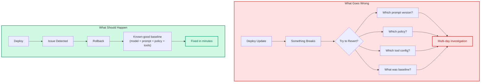

# Rollout and Rollback

| | |
|:--|:--|
| **Use when** | Planning a deployment, or after a rollback took too long |
| **Time** | 20 min read (target rollback: <5 min) |
| **Outcome** | Deployment strategy covering model, prompt, and policy versions |
| **Related** | [Pre-Ship Checklist](../00-templates/pre-ship-checklist.md) ・ [Tool Reliability](tool-reliability.md) |

---

**The ability to change system behavior safely and reverse it quickly.**

In AI systems, rollback must include model, prompt, policy, and tool versions. Rolling back code isn't enough.

---

## The Failure Mode

Teams deploy a model update. Something goes wrong. They try to revert.



But:
- The prompt was updated in a separate deploy
- The policy changed last week
- The tool configuration was modified
- There's no known-good baseline documented

Now "rollback" is a multi-day investigation.

---

## Principles

**1. Version everything that affects output**

If changing it can change the output, version it:
- Model versions
- Prompt templates
- System policies
- Tool configurations
- Guardrail rules

**2. Make rollback paths explicit and tested**

Document before you deploy:
- What's the previous known-good state?
- How do we get back to it?
- How long does it take?
- Who can trigger it?

**3. Separate canary traffic from production**

Route a small percentage of traffic to new versions first:
```
95% See: current version
5%  See: canary version
```

Monitor, then expand.

**4. Maintain a known-good baseline**

Always have a documented, tested configuration you can roll back to:
```yaml
baseline:
  model: gpt-4-0125
  prompt: v2.3.1
  policy: conservative-v1
  last_verified: 2026-01-15
```

---

## Rollback Checklist

Before any deploy:

- [ ] Previous version documented
- [ ] Rollback procedure documented
- [ ] Rollback tested in staging
- [ ] Rollback owner named
- [ ] Time-to-rollback estimated

If any is missing, you're not ready to deploy.

---

## The Litmus Test

> Can you revert a change within minutes without re-training or re-deploying the stack?

If rollback takes hours or requires investigation, it's not operational.

---

> *"In AI systems, rolling back code isn't enough. You need to roll back the entire decision surface."*
