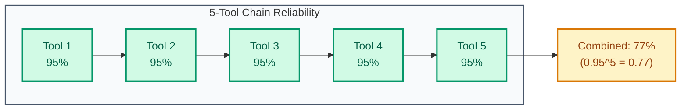

# Tool Reliability

- **Use when**: Agents are failing due to external tool issues, or you are designing a new agent system
- **Time**: 25 min read
- **Outcome**: Tool failure pattern understanding, resilience patterns
- **Related**: [orchestrator.py](../07-examples/orchestrator.py) ・ [Rollout and Rollback](rollout-and-rollback.md)

---

**The predictability and observability of external tools your agents call.**

When agents depend on tools, tool failure becomes agent failure. Your system is only as reliable as your least reliable tool.

---

## The Agent Tool Landscape (2025-2026)

| Tool Category | Reliability Challenge | Typical Failure Mode |
|---------------|----------------------|----------------------|
| **Search/RAG** | Index staleness, result quality drift | Returns outdated or irrelevant results |
| **Code execution** | Security, resource limits, timeouts | Hangs, crashes, or produces unsafe output |
| **Browser/Web** | Page changes, CAPTCHAs, rate limits | Fails silently or returns partial data |
| **APIs (third-party)** | Rate limits, schema changes, outages | Errors cascade through agent chain |
| **Database** | Connection pooling, query timeouts | Slow queries block agent progress |
| **File operations** | Permissions, storage limits | Silent failures or data corruption |

**The compounding problem**: Agents often chain tool calls. If each tool is 95% reliable, a 5-tool chain is only 77% reliable.



---

## The Risks

| Risk | What It Looks Like | Detection Method |
|------|-------------------|------------------|
| Unbounded latency | Tool hangs, agent waits forever | Timeouts, p99 latency tracking |
| Partial failures | Tool returns incomplete data, agent proceeds | Schema validation, completeness checks |
| Silent behavior changes | Tool API changes, outputs shift | Contract tests, output distribution monitoring |
| Rate limits | Tool throttles you mid-workflow | 429 tracking, quota monitoring |
| Inconsistent results | Same input, different outputs | Determinism tests, output hashing |
| Cascading failures | One tool failure triggers retries that overwhelm others | Dependency graph monitoring |

---

## Control Techniques

**1. Timeouts on every tool call**

```python
async def call_tool_with_timeout(tool, args, timeout_seconds=30):
    try:
        return await asyncio.wait_for(
            tool.execute(args),
            timeout=timeout_seconds
        )
    except asyncio.TimeoutError:
        log_timeout(tool.name, args)
        return ToolResult.timeout()
```

**2. Health checks per tool**

Don't wait for production failures. Continuously verify:
```python
class ToolHealthChecker:
    def check(self, tool):
        start = time.time()
        try:
            result = tool.ping()  # Lightweight health check
            latency = time.time() - start

            return HealthStatus(
                healthy=result.ok and latency < tool.latency_threshold,
                latency_ms=latency * 1000,
                last_check=datetime.now()
            )
        except Exception as e:
            return HealthStatus(healthy=False, error=str(e))
```

**3. Circuit breakers**

When a tool fails repeatedly, stop calling it:
```python
class CircuitBreaker:
    def __init__(self, failure_threshold=5, reset_timeout=60):
        self.failures = 0
        self.state = "closed"  # closed, open, half-open
        self.last_failure = None

    def call(self, tool, args):
        if self.state == "open":
            if self.should_try_reset():
                self.state = "half-open"
            else:
                return self.fallback()

        try:
            result = tool.execute(args)
            self.on_success()
            return result
        except Exception as e:
            self.on_failure()
            raise
```

**4. Fallback strategies**

Every tool call needs an answer to: "What do we do if this fails?"

| Strategy | When To Use | Trade-off |
|----------|-------------|-----------|
| Cached response | Tool is temporarily down, data is fresh enough | May serve stale data |
| Simpler alternative | Complex tool fails, basic version works | Reduced capability |
| Human escalation | High-stakes, no automated fallback | Latency, human availability |
| Graceful degradation | Feature can work without tool | Partial functionality |
| Fail fast | Tool is critical, no alternative | User sees error immediately |

**5. Contract tests**

Test tool behavior, not just availability:
```python
def test_search_tool_contract():
    # Schema validation
    result = search_tool.search("test query")
    assert_schema(result, SearchResultSchema)

    # Determinism test (where applicable)
    result1 = search_tool.search("deterministic query")
    result2 = search_tool.search("deterministic query")
    assert result1.ids == result2.ids  # Same results

    # Edge case behavior
    empty_result = search_tool.search("")
    assert empty_result.results == []  # Not an error
```

**6. Budget caps per tool per session**

Prevent runaway costs:
```python
class ToolBudgetEnforcer:
    def __init__(self, session_budget: float):
        self.budget = session_budget
        self.spent = 0.0

    def before_call(self, tool, args):
        estimated_cost = tool.estimate_cost(args)
        if self.spent + estimated_cost > self.budget:
            raise ToolBudgetExceeded(
                spent=self.spent,
                budget=self.budget,
                requested=estimated_cost
            )

    def after_call(self, tool, result):
        self.spent += result.actual_cost
```

---

## Observability Minimum

For every tool call, log:

```python
@dataclass
class ToolCallLog:
    trace_id: str           # Correlation ID
    tool_name: str          # Which tool
    input_hash: str         # Hash of input (for debugging without storing PII)
    output_hash: str        # Hash of output
    latency_ms: float       # How long it took
    status: str             # success, failure, timeout, rate_limited
    retry_count: int        # How many retries
    cost: float             # Estimated or actual cost
    error_type: str | None  # Error classification if failed
```

This lets you:
- Debug specific failures
- Track reliability trends over time
- Attribute cost to tools
- Identify drift before users complain
- Build reliability dashboards per tool

---

## Tool Reliability Dashboard

Track these metrics per tool:

| Metric | Good | Concerning | Critical |
|--------|------|------------|----------|
| Tool success rate | > 99% | 95-99% | < 95% |
| p50 latency | < 500ms | 500-2000ms | > 2000ms |
| p99 latency | < 2s | 2-10s | > 10s |
| Timeout rate | < 0.1% | 0.1-1% | > 1% |
| Circuit breaker trips | 0/day | 1-3/day | > 3/day |

---

## The Litmus Test

> If a third-party tool slows down, can your system degrade gracefully without user-visible chaos?

If the answer is "it depends on the tool," you need fallbacks.

---

## Further Reading

- [Release It!](https://pragprog.com/titles/mnee2/release-it-second-edition/) by Michael Nygard - Circuit breakers, bulkheads, timeouts
- [Designing Distributed Systems](https://azure.microsoft.com/en-us/resources/designing-distributed-systems/) - Microsoft's patterns guide
- [The Google SRE Book: Handling Overload](https://sre.google/sre-book/handling-overload/) - Load shedding, graceful degradation

---

> *"Your system is only as reliable as your least observable tool."*
