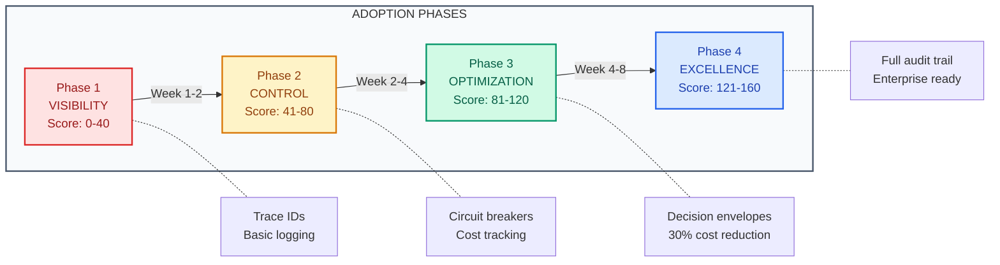

# Adoption Guide

| | |
|:--|:--|
| **Use when** | You want to apply these patterns to an existing system incrementally |
| **Time** | 10 min read, 2-4 weeks to implement Phase 1 |
| **Outcome** | Prioritized adoption plan based on your starting point |
| **Related** | [ASSESS.md](ASSESS.md) ・ [Quick Reference](QUICK-REFERENCE.md) |

---

## Table of Contents

- [Assess Your Starting Point](#assess-your-starting-point)
- [Phase 1: Visibility (Week 1-2)](#phase-1-visibility-week-1-2)
- [Phase 2: Control (Week 2-4)](#phase-2-control-week-2-4)
- [Phase 3: Optimization (Week 4-8)](#phase-3-optimization-week-4-8)
- [Phase 4: Excellence (Week 8+)](#phase-4-excellence-week-8)
- [Adoption by Role](#adoption-by-role)
- [Common Adoption Mistakes](#common-adoption-mistakes)
- [Quick Reference: What to Adopt When](#quick-reference-what-to-adopt-when)

---

You don't adopt this entire manual at once. You adopt it incrementally, prioritizing based on your current pain points.

---

## Assess Your Starting Point

Run the [10-minute assessment](ASSESS.md) to score your current state.



Your score determines your starting phase:

| Score | Starting Phase | Focus |
|-------|---------------|-------|
| 0-40 | Phase 1 (Visibility) | You're flying blind. Start with basic logging. |
| 41-80 | Phase 2 (Control) | You can see problems but can't fix them fast. |
| 81-120 | Phase 3 (Optimization) | You have control. Now optimize economics. |
| 121-160 | Phase 4 (Excellence) | Refine edge cases and prepare for scale. |

---

## Phase 1: Visibility (Week 1-2)

**Goal:** Be able to explain any output within 10 minutes.

### Minimum Viable Changes

1. **Add a trace ID to every inference call**

```python
import uuid

trace_id = str(uuid.uuid4())
# Pass trace_id through your entire request flow
```

2. **Log the decision context (not just the output)**

```python
log_entry = {
    "trace_id": trace_id,
    "timestamp": datetime.utcnow().isoformat(),
    "model_version": model_version,
    "prompt_version": prompt_version,
    "input_hash": hashlib.sha256(prompt.encode()).hexdigest()[:16],
    "trigger_type": "user_explicit",  # or undo, retry, auto_save
}
```

3. **Track trigger type**

```python
# Before
await generate(prompt)

# After
await generate(prompt, trigger_type="user_explicit")
await generate(prompt, trigger_type="undo")
await generate(prompt, trigger_type="auto_save")
```

### Success Criteria

- [ ] Can find any output from the last 24 hours by trace ID
- [ ] Can see what prompt version produced a given output
- [ ] Can distinguish user-initiated from system-initiated calls

### Documents to Read

- [Legibility Loss](01-failure-modes/legibility-loss.md)
- [Before/After Patterns](07-examples/before-after-patterns.md) (Patterns 1-2)

---

## Phase 2: Control (Week 2-4)

**Goal:** Respond to incidents in under 30 minutes.

### Minimum Viable Changes

1. **Implement circuit breakers for external calls**

```python
from circuitbreaker import circuit

@circuit(failure_threshold=5, recovery_timeout=30)
async def call_external_tool(request):
    return await external_api.call(request)
```

2. **Add cost tracking to every inference call**

```python
log_entry["cost_usd"] = (
    input_tokens * INPUT_PRICE_PER_TOKEN +
    output_tokens * OUTPUT_PRICE_PER_TOKEN
)
```

3. **Create a rollback procedure**

```bash
# Document this and test it
./scripts/rollback.sh --to-version $PREVIOUS_VERSION
```

4. **Set up basic alerts**

```yaml
# Alert when hidden recompute exceeds threshold
- alert: HighHiddenRecompute
  expr: |
    sum(rate(inference_calls{trigger_type!="user_explicit"}[1h])) 
    / sum(rate(inference_calls[1h])) > 0.3
  for: 15m
```

### Success Criteria

- [ ] Circuit breakers prevent cascade failures
- [ ] Can see cost per feature/endpoint
- [ ] Rollback takes under 5 minutes
- [ ] Alerts fire before users notice problems

### Documents to Read

- [Tool Reliability](06-operations/tool-reliability.md)
- [Cost Model](03-economics/cost-model.md)
- [Rollout and Rollback](06-operations/rollout-and-rollback.md)

---

## Phase 3: Optimization (Week 4-8)

**Goal:** Reduce cost per outcome by 30% or more.

### Minimum Viable Changes

1. **Implement decision envelopes**

```json
{
  "trace_id": "uuid",
  "timestamp": "iso8601",
  "inputs": {"user_action": "...", "context_hash": "..."},
  "policy": {"model_version": "...", "prompt_version": "..."},
  "tools_called": [...],
  "output": {"result_id": "...", "state": "draft|committed"},
  "cost_usd": 0.023
}
```

2. **Track speculative vs committed work**

```sql
-- What percentage of work is actually used?
SELECT 
  COUNT(CASE WHEN state = 'committed' THEN 1 END)::float 
  / COUNT(*) as commit_rate
FROM inference_events
WHERE created_at > NOW() - INTERVAL '7 days';
```

3. **Identify and fix your top cost drivers**

Run [Cost Spike Runbook](00-templates/cost-spike-runbook.md) proactively.

4. **Add eval gates to CI/CD**

```yaml
- name: Run eval suite
  run: python -m pytest tests/evals/ --threshold 0.85
  if: failure()
  run: exit 1  # Block deployment
```

### Success Criteria

- [ ] Know cost per successful outcome (not just cost per call)
- [ ] Speculative work is under 30% of total
- [ ] Top 3 cost drivers are identified and tracked
- [ ] Eval pass rate is monitored and gated

### Documents to Read

- [Hidden Recompute](03-economics/hidden-recompute.md)
- [Margin Fragility](01-failure-modes/margin-fragility.md)
- [Eval and Regression](06-operations/eval-and-regression.md)

---

## Phase 4: Excellence (Week 8+)

**Goal:** Enterprise-ready operations.

### Focus Areas

1. **Full auditability**
   - Complete decision envelopes for all outputs
   - 6-month retention with reconstruction capability
   - Human approval logging

2. **Capacity planning**
   - Predictive cost modeling
   - Token budget allocation
   - Scaling triggers defined

3. **Compliance readiness**
   - Data residency controls
   - Audit trail for SOC2/ISO
   - Operational independence from providers

4. **Advanced guardrails**
   - Multi-layer safety surface
   - Abuse detection
   - Rate limiting by behavior pattern

### Success Criteria

- [ ] Can reconstruct any decision from 6 months ago
- [ ] Capacity planned for 10x current scale
- [ ] Pass enterprise security questionnaires
- [ ] Self-healing for common failure modes

### Documents to Read

- [Audit Preparation](04-compliance/audit-preparation.md)
- [Capacity Planning](03-economics/capacity-planning.md)
- [Safety Surface](06-operations/safety-surface.md)
- [Operational Independence](04-compliance/operational-independence.md)

---

## Adoption by Role

### If You're a Principal Engineer

1. Start with Phase 1 changes in a single service
2. Measure before/after for one week
3. Present results to team
4. Expand to Phase 2

### If You're a CTO/VPE

1. Have team run [ASSESS.md](ASSESS.md)
2. Identify which failure mode is most urgent
3. Assign owner for Phase 1 adoption
4. Schedule monthly review using [System Drift Review](06-operations/system-drift-review.md)

### If You're an ML Engineer

1. Start with trigger type logging (immediate value)
2. Add cost tracking to your training/eval pipelines
3. Implement eval gates in CI

### If You're a Platform Team

1. Build shared logging infrastructure with decision envelope support
2. Create circuit breaker library for team use
3. Build cost attribution into your observability stack

---

## Common Adoption Mistakes

### Trying to do everything at once

**Symptom:** 3-month adoption plan with 47 tasks.

**Fix:** Pick one phase, one week, three changes. Expand only after proving value.

### Adopting without buy-in

**Symptom:** You implement logging, no one looks at the logs.

**Fix:** Start with a visible problem (e.g., "why did costs spike last week?"), solve it publicly, then systematize.

### Over-engineering early

**Symptom:** Building a complete decision envelope system before you have trace IDs.

**Fix:** Layered adoption. Each phase builds on the previous. Don't skip.

### Not measuring improvement

**Symptom:** "We adopted the patterns" but no quantified improvement.

**Fix:** Track these metrics before and after:
- Time to explain a random output
- Hidden recompute ratio
- Cost per outcome
- Incident response time

---

## Quick Reference: What to Adopt When

| Pain Point | Start With | Phase |
|------------|------------|-------|
| "Why did it do that?" | Trace IDs + prompt versioning | 1 |
| "Costs are unpredictable" | Trigger type logging | 1 |
| "Incidents take hours to resolve" | Circuit breakers + rollback | 2 |
| "Margin is collapsing" | Cost per outcome tracking | 3 |
| "Enterprise customers want audit trails" | Decision envelopes | 3-4 |
| "We can't pass SOC2" | Full compliance readiness | 4 |

---

## Related

- [ASSESS.md](ASSESS.md) - Score your current state
- [Quick Reference Card](QUICK-REFERENCE.md) - Keep visible during adoption
- [Weekly Ops Checklist](00-templates/weekly-ops-checklist.md) - Maintain after adoption
