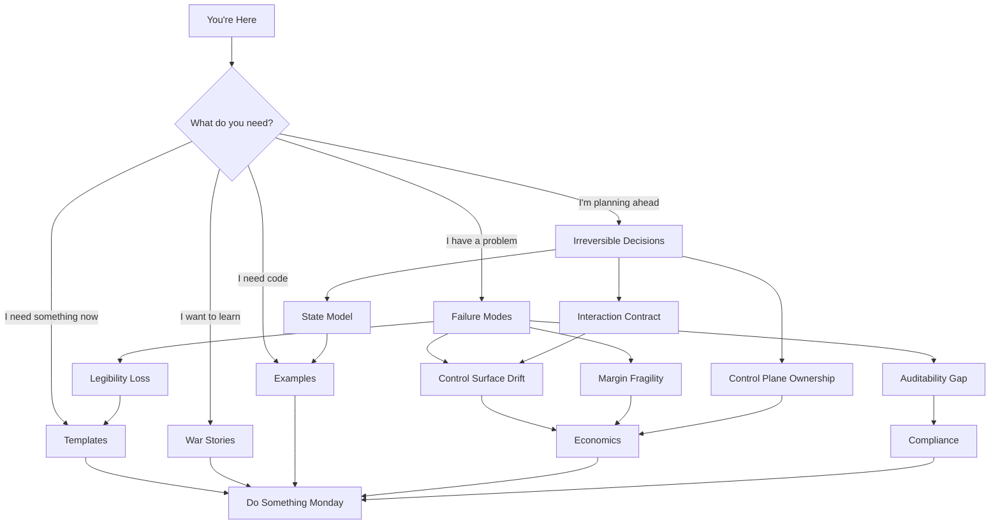
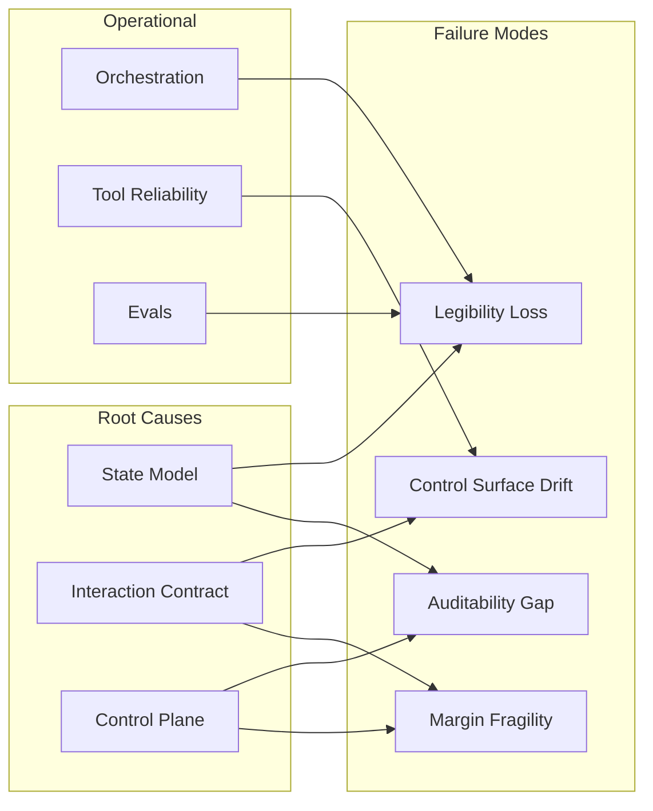

# Navigation Map

## How This Repo Is Organized



---

## Quick Links by Situation

### "I have a problem right now"

| If You're Facing... | Start Here |
|---------------------|------------|
| "Why did it do that?" and no one knows | [Legibility Loss](failure-modes/legibility-loss.md) |
| Margin erosion with flat traffic | [Margin Fragility](failure-modes/margin-fragility.md) |
| Enterprise customer asking for audit trail | [Auditability Gap](failure-modes/auditability-gap.md) |
| Hidden costs you can't explain | [Control Surface Drift](failure-modes/control-surface-drift.md) |
| Crisis happening right now | [First 48 Hours](templates/first-48-hours.md) |

---

### "I'm planning architecture"

| If You're Deciding... | Start Here |
|----------------------|------------|
| What data to persist | [State Model](irreversible-decisions/state-model.md) |
| What users can do | [Interaction Contract](irreversible-decisions/interaction-contract.md) |
| API vs owned infrastructure | [Control Plane Ownership](irreversible-decisions/control-plane-ownership.md) |
| Whether to build or rent inference | [API vs Owned](economics/api-vs-owned.md) |

---

### "I need to run something"

| If You Need... | Start Here |
|----------------|------------|
| A pre-ship checklist | [Traceability Checklist](templates/traceability-checklist.md) |
| To log an architecture decision | [Decision Log](templates/decision-log.md) |
| A quarterly review framework | [System Drift Review](templates/system-drift-review.md) |
| To explain this to the board | [Board Explainer](templates/board-explainer.md) |

---

### "I need code"

| If You Need... | Start Here |
|----------------|------------|
| A schema for decision envelopes | [decision-envelope-schema.json](examples/decision-envelope-schema.json) |
| Database tables for traceability | [traceability-postgres-schema.sql](examples/traceability-postgres-schema.sql) |
| Dashboard queries for cost monitoring | [recompute-dashboard-queries.md](examples/recompute-dashboard-queries.md) |
| Middleware for capturing provenance | [fastapi-provenance-middleware.py](examples/fastapi-provenance-middleware.py) |

---

### "I want to learn from examples"

| If You Want To See... | Read |
|----------------------|------|
| How hidden recompute destroys margin | [The Undo Button That Killed Our Margin](war-stories/the-undo-button-that-killed-our-margin.md) |
| Why state models need to be right from day 1 | [Why We Rebuilt State Twice](war-stories/why-we-rebuilt-state-twice.md) |
| How auditability gaps kill deals | [The Compliance Question We Couldn't Answer](war-stories/the-compliance-question-we-couldnt-answer.md) |
| How to transition from API to owned | [From API to Owned in 90 Days](war-stories/from-api-to-owned-in-90-days.md) |

---

## Concept Relationships



---

## Reading Paths

### For the New Principal Engineer

1. Start with [README](README.md) for the thesis
2. Read [The 4 Failure Modes](failure-modes/) overview
3. Pick one failure mode that resonates and read the details
4. Look at one war story for context
5. Use one template in your next planning meeting

### For the CTO Preparing for a Board Meeting

1. Read [Board Explainer](templates/board-explainer.md) template
2. Scan [Margin Fragility](failure-modes/margin-fragility.md) for language
3. Review [Irreversible Decisions](irreversible-decisions/) for strategic framing

### For the Engineer Implementing Traceability

1. Start with [Traceability Checklist](templates/traceability-checklist.md)
2. Review [decision-envelope-schema.json](examples/decision-envelope-schema.json)
3. Implement [traceability-postgres-schema.sql](examples/traceability-postgres-schema.sql)
4. Add [fastapi-provenance-middleware.py](examples/fastapi-provenance-middleware.py)
5. Set up monitoring with [recompute-dashboard-queries.md](examples/recompute-dashboard-queries.md)

---

## Full Directory Structure

```
├── README.md                    # Start here
├── AUTHOR.md                    # About the author
├── MAP.md                       # This file
├── glossary.md                  # Terms and board-level explanations
│
├── failure-modes/               # The 4 failure modes
│   ├── README.md
│   ├── legibility-loss.md
│   ├── control-surface-drift.md
│   ├── auditability-gap.md
│   └── margin-fragility.md
│
├── irreversible-decisions/      # The 3 decisions you can't undo
│   ├── README.md
│   ├── state-model.md
│   ├── interaction-contract.md
│   └── control-plane-ownership.md
│
├── operating-model/             # Day-to-day operations
│   ├── README.md
│   ├── orchestration.md
│   ├── tool-reliability.md
│   ├── eval-and-regression.md
│   ├── safety-surface.md
│   ├── human-in-the-loop.md
│   ├── rollout-and-rollback.md
│   ├── latency-slo-coupling.md
│   └── data-privacy.md
│
├── economics/                   # Cost and margin
│   ├── README.md
│   ├── hidden-recompute.md
│   ├── cost-model.md
│   ├── api-vs-owned.md
│   └── capacity-planning.md
│
├── compliance/                  # Audit and sovereignty
│   ├── README.md
│   ├── auditability.md
│   ├── sovereignty.md
│   └── operational-independence.md
│
├── templates/                   # Use Monday
│   ├── README.md
│   ├── decision-log.md
│   ├── system-drift-review.md
│   ├── traceability-checklist.md
│   ├── first-48-hours.md
│   └── board-explainer.md
│
├── war-stories/                 # Learn from examples
│   ├── README.md
│   ├── the-undo-button-that-killed-our-margin.md
│   ├── why-we-rebuilt-state-twice.md
│   ├── the-compliance-question-we-couldnt-answer.md
│   └── from-api-to-owned-in-90-days.md
│
└── examples/                    # Code and schemas
    ├── README.md
    ├── decision-envelope-schema.json
    ├── traceability-postgres-schema.sql
    ├── recompute-dashboard-queries.md
    └── fastapi-provenance-middleware.py
```
