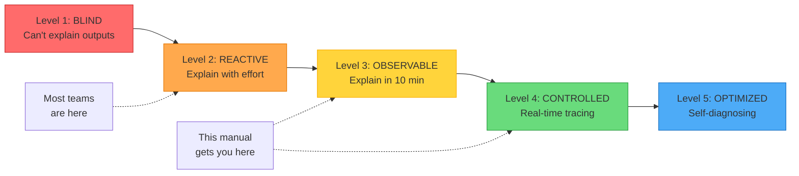
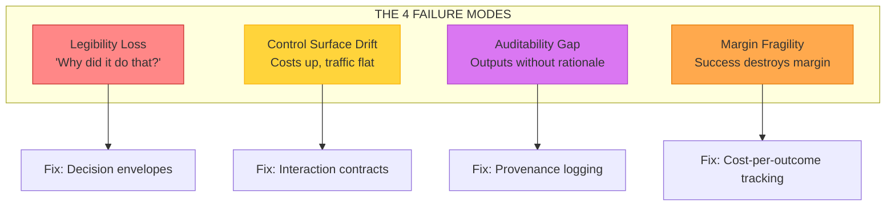
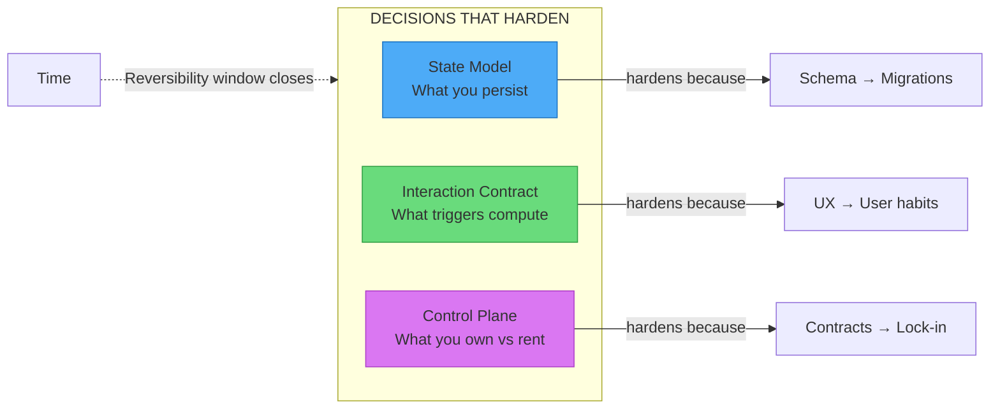

<div align="center">

# Agentic Field Manual

### The missing operations manual for production AI systems.

<br/>

[](LICENSE)
[](https://github.com/whoisrade/agentic-field-manual/commits/main)
[](https://github.com/whoisrade/agentic-field-manual/stargazers)
[](CONTRIBUTING.md)
[](AUTHOR.md)

**[Quick Start](#quick-start-5-minutes)** · **[Assess Your System](ASSESS.md)** · **[Crisis Mode](00-templates/first-48-hours.md)** · **[Quick Reference](QUICK-REFERENCE.md)**

</div>

---

**Agentic systems fail silently, expensively, then catastrophically.** This manual gives you the patterns, checklists, and code to prevent that—from a team that learned operating 1.5M+ MAU systems the hard way.

---

## Table of Contents

- [Why This Exists](#why-this-exists)
- [Who This Is For](#who-this-is-for)
- [Quick Start (5 minutes)](#quick-start-5-minutes)
- [What's Your Situation?](#whats-your-situation)
- [Maturity Levels](#maturity-levels)
- [The 4 Failure Modes](#the-4-failure-modes)
- [Case Studies](#case-studies)
- [Reference](#reference)
- [Contributing](#contributing)

---

## Used By

<div align="center">

| | | | |
|:---:|:---:|:---:|:---:|
| [**Filekit**](https://filekit.ai) | [**ShortlistIQ**](https://shortlistiq.com) | [**Olovka**](https://olovka.ai) | [**Rumora**](https://rumora.ai) |
| Agentic document generation | Autonomous interview agents | Academic AI with 100K+ users | 50K+ social media agents |
| McKinsey-level docs at scale | First-round candidate screening | 20M source citation database | Brand placement orchestration |

</div>

---

## Why This Exists

Most AI documentation focuses on **building** systems. Almost none covers **operating** them at scale.

When your AI system:
- Costs 10x what you budgeted and you can't explain why
- Produces an output that a customer questions and you can't reconstruct the reasoning
- Passes all evals but users keep hitting "regenerate"
- Works perfectly until an enterprise customer asks for an audit trail

...you need operational patterns, not tutorials.

This manual contains everything I learned building systems with 1.5M+ MAU, 30M+ monthly API calls, and 50K+ orchestrated agents. It's opinionated, battle-tested, and designed for immediate use.

---

## Who This Is For

- **Principal Engineers** inheriting or building agentic systems
- **CTOs/VPEs** who need to understand AI operational risk
- **AI/ML Engineers** shipping to production (not just prototyping)
- **Platform Teams** building shared AI infrastructure

### When NOT to Use This

- You're building a demo or proof-of-concept
- Your system has <1000 users and no compliance requirements
- You're using AI for internal tools with no customer exposure
- You have unlimited budget and no margin constraints

This manual is for production systems where failure has consequences.

---

## Quick Start (5 minutes)

Add this to your inference calls today:

```python
# Minimum viable traceability - start here
def log_inference(request, response, model_version, prompt_version):
    return {
        "trace_id": str(uuid.uuid4()),
        "trigger_type": request.get("trigger", "user_explicit"),
        "model_version": model_version,
        "prompt_version": prompt_version,
        "cost_usd": calculate_cost(response.usage),
        "state": "speculative",  # → "committed" when user accepts
    }
```

Then run weekly:

```sql
SELECT SUM(cost_usd) / NULLIF(COUNT(DISTINCT CASE 
  WHEN state = 'committed' THEN trace_id END), 0) as cost_per_outcome
FROM inference_logs WHERE created_at > NOW() - INTERVAL '7 days';
```

**If cost per outcome is rising**, you have a problem → [Cost Investigation](03-economics/cost-investigation.md)

---

## How to Use This Manual

| Your Role | Start Here | Then Read |
|-----------|------------|-----------|
| **Just inherited a system** | [System Assessment](ASSESS.md) | [Failure Modes](01-failure-modes/README.md) |
| **Building something new** | [State Model](02-architecture/state-model.md) | [Interaction Contract](02-architecture/interaction-contract.md) |
| **In crisis mode** | [First 48 Hours](00-templates/first-48-hours.md) | [Cost Spike Runbook](00-templates/cost-spike-runbook.md) |
| **Presenting to leadership** | [Board Explainer](05-communication/board-explainer.md) | [Stakeholder Glossary](05-communication/stakeholder-glossary.md) |
| **Setting up observability** | [Metrics Reference](07-examples/metrics-reference.md) | [Eval and Regression](06-operations/eval-and-regression.md) |

> [!TIP]
> **First time here?** Run the [10-minute assessment](ASSESS.md) to identify your gaps and get personalized recommendations.

---

## What's Your Situation?

### Something Is On Fire

| Situation | Do This | Time |
|-----------|---------|------|
| System is failing, costs exploding, quality collapsing | [First 48 Hours](00-templates/first-48-hours.md) | 2-8 hours |
| Cannot explain why the system did something | [Legibility Loss](01-failure-modes/legibility-loss.md) | 30 min read, then fix |
| Costs rising but traffic is flat | [Cost Spike Runbook](00-templates/cost-spike-runbook.md) | 30-60 min |
| Enterprise deal dying due to audit questions | [Audit Preparation](04-compliance/audit-preparation.md) | 2-4 hours |
| Just resolved a P0/P1 incident | [Incident Post-Mortem](00-templates/incident-postmortem.md) | 1-2 hours |

### I'm About to Ship

| Situation | Do This | Time |
|-----------|---------|------|
| Launching an agentic feature this week | [Pre-Ship Checklist](00-templates/pre-ship-checklist.md) | 1-2 hours |
| Making an architecture decision | [Decision Record](00-templates/decision-record.md) | 15-60 min |

### I Just Inherited This System

| Question to Answer | Read This | Time |
|--------------------|-----------|------|
| What are the failure modes I should watch for? | [Failure Modes Overview](01-failure-modes/README.md) | 20 min |
| What decisions are already locked in? | [Architecture Decisions](02-architecture/README.md) | 30 min |
| What should I be monitoring? | [Metrics Reference](07-examples/metrics-reference.md) | 30 min |
| What questions should I ask the team? | [System Review Questions](#system-review-questions) | 10 min |

### I Need to Present to Leadership

| Situation | Do This | Time |
|-----------|---------|------|
| Board meeting about AI risk | [Board Explainer](05-communication/board-explainer.md) | 30 min read, 1 hour customize |
| CFO asking about margin | [Cost Model](03-economics/cost-model.md) + [Margin Fragility](01-failure-modes/margin-fragility.md) | 1 hour |
| Need to translate terms | [Stakeholder Glossary](05-communication/stakeholder-glossary.md) | 10 min |

### I'm Reviewing Someone's Design

| What to Check | Reference | Questions to Ask |
|---------------|-----------|------------------|
| State model | [State Model](02-architecture/state-model.md) | Is speculative state explicit? Can you reconstruct decisions? |
| Interaction contract | [Interaction Contract](02-architecture/interaction-contract.md) | What triggers recompute? What's the cost per action? |
| Control plane | [Control Plane Ownership](02-architecture/control-plane-ownership.md) | What do you own vs rent? What's the exit plan? |
| Orchestration | [Orchestration](06-operations/orchestration.md) | How do you handle failures? What's the cost cap? |
| Guardrails | [Safety Surface](06-operations/safety-surface.md) | What layers of defense? What's the abuse surface? |

### I'm Building Something New

| Phase | Key Documents |
|-------|---------------|
| Design | [State Model](02-architecture/state-model.md), [Interaction Contract](02-architecture/interaction-contract.md), [Orchestration](06-operations/orchestration.md) |
| Implementation | [Before/After Patterns](07-examples/before-after-patterns.md), [Metrics Reference](07-examples/metrics-reference.md) |
| Pre-Launch | [Pre-Ship Checklist](00-templates/pre-ship-checklist.md) |
| Post-Launch | [Weekly Ops Checklist](00-templates/weekly-ops-checklist.md), [System Drift Review](06-operations/system-drift-review.md) |

### I'm Setting Up Evals

| Task | Document | Time |
|------|----------|------|
| Understand eval approaches | [Eval and Regression](06-operations/eval-and-regression.md) | 30 min |
| Get LLM-as-judge prompts | [LLM-as-Judge Prompts](07-examples/llm-as-judge-prompts.md) | 20 min |
| Set up CI/CD quality gates | [Examples](07-examples/README.md) | 2-4 hours |

---

## System Review Questions

Use these when assessing any agentic system:

### Traceability (5 min)

- [ ] Pick a random output from yesterday. Can you explain it in under 10 min?
- [ ] Do you have trace IDs that follow requests end-to-end?
- [ ] Are model and prompt versions recorded with each output?

### Economics (5 min)

- [ ] Do you know your cost per successful outcome?
- [ ] What percentage of compute is hidden (retries, undo, auto-save)?
- [ ] At 10x usage, do unit economics improve, stay flat, or collapse?

### Auditability (5 min)

- [ ] Can you prove what the system knew at decision time?
- [ ] Are human approvals recorded with timestamps?
- [ ] Can you reconstruct a decision from 6 months ago?

### Reliability (5 min)

- [ ] What happens when an external tool fails?
- [ ] Do you have circuit breakers?
- [ ] How long does rollback take?

**Scoring:**
- All checked: Healthy
- Most checked: Warning - prioritize gaps
- Few checked: Critical - use [First 48 Hours](00-templates/first-48-hours.md)

---

## Quick Diagnostics

Run weekly:

| Metric | Healthy | Warning | Critical |
|--------|---------|---------|----------|
| Time to explain any output | Under 10 min | 10-60 min | Over 1 hour |
| Hidden recompute ratio | Under 20% | 20-40% | Over 40% |
| Cost per outcome trend | Stable | Rising under 10% MoM | Rising over 10% MoM |
| Outputs missing decision records | Under 5% | 5-20% | Over 20% |
| Eval pass rate | Over 90% | 85-90% | Under 85% |

See [Metrics Reference](07-examples/metrics-reference.md) for how to calculate these.

---

## Maturity Levels

Where is your system?



| Level | Traceability | Economics | Auditability | Reliability |
|-------|--------------|-----------|--------------|-------------|
| **1: Blind** | Cannot explain outputs | Do not know cost per outcome | Logs only | No circuit breakers |
| **2: Reactive** | Can explain with effort (1+ hour) | Know cost, not tracking trend | Some provenance | Manual rollback |
| **3: Observable** | Can explain in 10 min | Weekly cost tracking | Decision envelopes | Circuit breakers exist |
| **4: Controlled** | Real-time tracing | Cost alerts, capacity planning | Full audit trail | Automated rollback |
| **5: Optimized** | Self-diagnosing | Predictive cost modeling | Proactive compliance | Self-healing |

**Most teams are at Level 2.** This manual helps you get to Level 3-4.

To assess your level, run the [System Review Questions](#system-review-questions).

---

## Severity Levels

When something goes wrong, classify it:

| Severity | Definition | Response Time | Example |
|----------|------------|---------------|---------|
| **P0** | System down or data loss | Immediate, all hands | Complete outage, wrong outputs at scale |
| **P1** | Major feature broken, revenue impact | Within 1 hour | Costs 10x normal, key workflow broken |
| **P2** | Feature degraded, workaround exists | Within 4 hours | Slow responses, intermittent failures |
| **P3** | Minor issue, no revenue impact | Within 1 week | Edge case bug, cosmetic issue |

Use [First 48 Hours](00-templates/first-48-hours.md) for P0/P1. Regular process for P2/P3.

---

## The 4 Failure Modes



| Failure Mode | Signal | Root Cause |
|--------------|--------|------------|
| [Legibility Loss](01-failure-modes/legibility-loss.md) | "Why did it do that?" takes hours | Missing decision context |
| [Control Surface Drift](01-failure-modes/control-surface-drift.md) | Costs rise, traffic flat | User behavior triggers hidden compute |
| [Auditability Gap](01-failure-modes/auditability-gap.md) | Can show outputs, not rationale | Logging without provenance |
| [Margin Fragility](01-failure-modes/margin-fragility.md) | Success destroys margin | No cost-per-outcome tracking |

---

## The 3 Irreversible Decisions



| Decision | Controls | Why It Hardens |
|----------|----------|----------------|
| [State Model](02-architecture/state-model.md) | What you persist | Downstream systems depend on schema |
| [Interaction Contract](02-architecture/interaction-contract.md) | What triggers compute | Users form habits around UX |
| [Control Plane Ownership](02-architecture/control-plane-ownership.md) | What you own vs rent | Contracts and migrations lock in |

---

## Case Studies

| Story | Lesson |
|-------|--------|
| [The Undo Button That Killed Our Margin](08-war-stories/the-undo-button-that-killed-our-margin.md) | Hidden recompute from "free" UI actions |
| [Why We Rebuilt State Twice](08-war-stories/why-we-rebuilt-state-twice.md) | State model closes reversibility window |
| [The Compliance Question We Couldn't Answer](08-war-stories/the-compliance-question-we-couldnt-answer.md) | Auditability gaps kill enterprise deals |
| [From API to Owned in 90 Days](08-war-stories/from-api-to-owned-in-90-days.md) | When to transition inference ownership |

---

## Reference

| Resource | Purpose |
|----------|---------|
| [Quick Reference Card](QUICK-REFERENCE.md) | One-page summary - print this |
| [System Assessment](ASSESS.md) | 10-minute self-assessment with scoring |
| [Adoption Guide](ADOPTION.md) | How to implement these patterns incrementally |
| [Anti-Patterns](ANTI-PATTERNS.md) | Common mistakes to avoid |
| [Alternatives Comparison](ALTERNATIVES.md) | How this compares to LangSmith, Braintrust, etc. |
| [Conversation Scripts](05-communication/conversation-scripts.md) | Exact words for stakeholder meetings |
| [Glossary](GLOSSARY.md) | All terms with technical and executive definitions |
| [Metrics Reference](07-examples/metrics-reference.md) | Formulas and queries for every metric |
| [Examples](07-examples/README.md) | Production code and schemas |
| [Templates](00-templates/README.md) | Documents you copy and fill in |

---

## Full Topic Index

<details>
<summary>Expand for complete navigation by topic</summary>

### Architecture and Design

| Topic | Document |
|-------|----------|
| State persistence | [State Model](02-architecture/state-model.md) |
| User action triggers | [Interaction Contract](02-architecture/interaction-contract.md) |
| Build vs buy | [API vs Owned](03-economics/api-vs-owned.md) |
| Control plane | [Control Plane Ownership](02-architecture/control-plane-ownership.md) |
| Multi-agent orchestration | [Orchestration](06-operations/orchestration.md) |
| Tool failure handling | [Tool Reliability](06-operations/tool-reliability.md) |

### Cost and Economics

| Topic | Document |
|-------|----------|
| Cost investigation | [Cost Investigation](03-economics/cost-investigation.md) |
| Cost per outcome | [Cost Model](03-economics/cost-model.md) |
| Hidden recompute | [Hidden Recompute](03-economics/hidden-recompute.md) |
| Capacity planning | [Capacity Planning](03-economics/capacity-planning.md) |
| Margin at scale | [Margin Fragility](01-failure-modes/margin-fragility.md) |

### Quality and Reliability

| Topic | Document |
|-------|----------|
| Evals and regression | [Eval and Regression](06-operations/eval-and-regression.md) |
| Latency and SLOs | [Latency and SLOs](06-operations/latency-slo-coupling.md) |
| Rollout and rollback | [Rollout and Rollback](06-operations/rollout-and-rollback.md) |
| Safety and guardrails | [Safety Surface](06-operations/safety-surface.md) |
| Human oversight | [Human in the Loop](06-operations/human-in-the-loop.md) |

### Compliance

| Topic | Document |
|-------|----------|
| Audit preparation | [Audit Preparation](04-compliance/audit-preparation.md) |
| Auditability requirements | [Auditability](04-compliance/auditability.md) |
| Data sovereignty | [Sovereignty](04-compliance/sovereignty.md) |
| Operational independence | [Operational Independence](04-compliance/operational-independence.md) |
| Data privacy | [Data Privacy](06-operations/data-privacy.md) |

</details>

---

## Contributing

Found a bug? Have a war story to share? See [CONTRIBUTING.md](CONTRIBUTING.md).

---

## About the Author

**[Rade Joksimovic](AUTHOR.md)** - Principal engineer focused on AI systems at scale.

- 15+ years building SaaS systems
- Recent focus: LLM-driven products and agentic infrastructure
- Scale: 1.5M+ MAU, 30M+ monthly API calls, 50K+ orchestrated agents

[Twitter](https://twitter.com/whoisrade) ・ [LinkedIn](https://linkedin.com/in/radejoksimovic) ・ [Email](mailto:rade.joksimovic@gmail.com)

---

## Acknowledgments

Thanks to the teams at [Filekit](https://filekit.ai), [ShortlistIQ](https://shortlistiq.com), [Olovka](https://olovka.ai), and [Rumora](https://rumora.ai) for battle-testing these patterns across diverse agentic architectures—from document generation to autonomous interviewing to social media orchestration.

Special thanks to everyone who shared war stories, reported issues, and contributed patterns from their own production systems.

---

<div align="center">

*If you can explain the output, you have control.*  
*If you cannot, you are negotiating with your own product.*

<br/>

**[⬆ Back to Top](#agentic-field-manual)**

</div>
